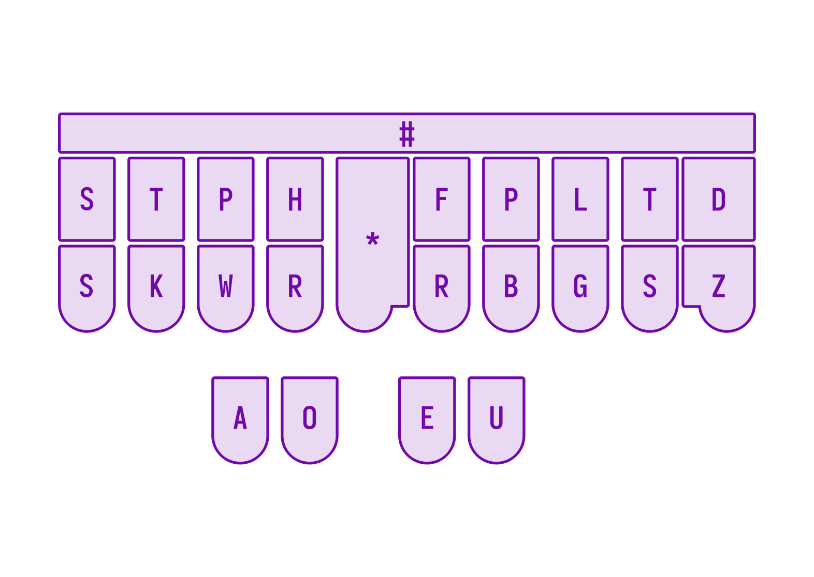
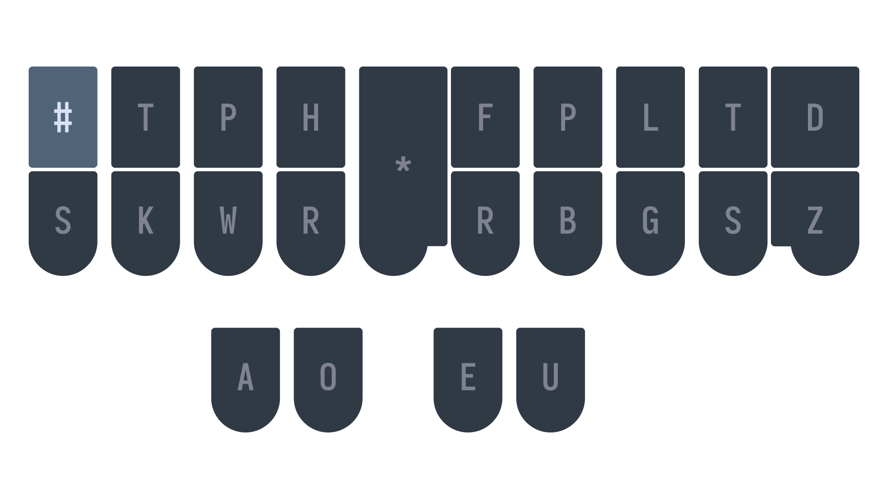

# Setting up Lapwing manually

This page describes how to manually configure Plover to use Lapwing theory. This is not a recommended method for two reasons: there is a lot of manual work required, and Plover will have a tendency to modify the number key entries, thereby making lookups difficult.

If any change is made directly to a Lapwing dictionary, Plover will change all entries with the number key so that they contain numbers in the steno strokes (i.e. `#PWOB` → `3W0B`). To revert this, you will have to redownload the dictionary and update the dictionary in your stack. Therefore, I would suggest installing the <code class="code-mono">plover-lapwing-aio</code> plugin instead of following the instructions on this page.

## Install required plugins

See the Plover wiki page on [installing plugins](https://plover.wiki/index.php/Plugins#How_to_Install_Plugins) for instructions. Install the following plugins:

* <code class="code-mono">plover-dict-commands</code>
* <code class="code-mono">plover-last-translation</code>
* <code class="code-mono">plover-modal-dictionary</code>
* <code class="code-mono">plover-python-dictionary</code>
* <code class="code-mono">plover-stitching</code>

Note that you can install all four plugins before restarting Plover.

### Enable <code class="code-mono">modal_update</code>

In Plover's main window, go to <code class="code-mono">Configure → Plugins</code> and click on the <code class="code-mono">modal_update</code> box.

> If you don't see this box, make sure you've installed the <code class="code-mono">plover-modal-dictionary</code> plugin and restarted Plover.

## Download the dictionaries

Download the dictionaries by right clicking the following links and pressing <code class="code-mono">Save link as</code> (or whatever the equivalent is for your browser):

* [<code class="code-mono">jeff-phrasing.py</code>](https://raw.githubusercontent.com/aerickt/steno-dictionaries/plover-lapwing-aio/jeff-phrasing.py)
* [<code class="code-mono">abby-left-hand-modifiers.py</code>](https://raw.githubusercontent.com/aerickt/steno-dictionaries/plover-lapwing-aio/abby-left-hand-modifiers.py)
* [<code class="code-mono">emily-modifiers.py</code>](https://raw.githubusercontent.com/aerickt/steno-dictionaries/plover-lapwing-aio/emily-modifiers.py)
* [<code class="code-mono">emily-symbols.py</code>](https://raw.githubusercontent.com/aerickt/steno-dictionaries/plover-lapwing-aio/emily-symbols.py)
* [<code class="code-mono">lapwing-movement.modal</code>](https://raw.githubusercontent.com/aerickt/steno-dictionaries/main/lapwing-movement.modal)
* [<code class="code-mono">lapwing-commands.json</code>](https://raw.githubusercontent.com/aerickt/steno-dictionaries/main/lapwing-commands.json)
* [<code class="code-mono">lapwing-numbers.json</code>](https://raw.githubusercontent.com/aerickt/steno-dictionaries/main/lapwing-numbers.json)
* [<code class="code-mono">lapwing-uk-additions.json</code>](https://raw.githubusercontent.com/aerickt/steno-dictionaries/main/lapwing-uk-additions.json)
* [<code class="code-mono">lapwing-proper-nouns.json</code>](https://raw.githubusercontent.com/aerickt/steno-dictionaries/main/lapwing-proper-nouns.json)
* [<code class="code-mono">lapwing-base.json</code>](https://raw.githubusercontent.com/aerickt/steno-dictionaries/main/lapwing-base.json)

Next, in the Plover main window, click on the green plus button:

Select "Load dictionaries" and you will be greeted with a window to select all the dictionaries that you downloaded earlier. Next, click on <code class="code-mono">main.json</code> and press the red X button to delete it from your dictionary stack. Do the same for commands.json.

Now, select each dictionary and make sure they are listed in your stack in the same order as shown below by using the blue arrow keys or dragging them around.

## Relocate the number key

On professional steno machines, there is a long key that runs at the very top of the steno layout (called the number bar). It is in a somewhat awkward location, but for most mainstream steno theories, it doesn't matter; it is only used for writing numbers.

However, Lapwing theory uses the number key quite extensively (especially in proper nouns) and therefore puts it in a more convenient location. Lapwing removes one of the redundant `S` keys on the left and replaces it with the number key.

This key is not configured by default, so you will have to change it yourself. In the main window of Plover, go to <code class="code-mono">Configure → Machine</code>.

Scroll down to the keymap, and change either <code class="code-mono">S1</code> or <code class="code-mono">q</code> to `#` depending on whether you are using Gemini PR or keyboard as the machine.

Triple click on the cell next to the key to open the dropdown. From there, you will be able to change the action to `#`.

