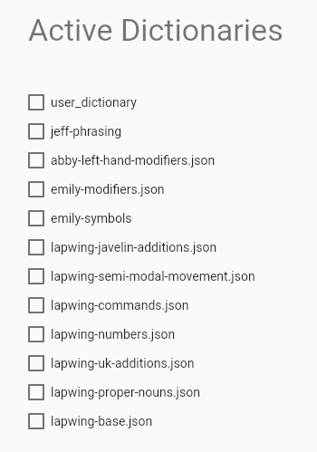

# Lapwing with Javelin

Javelin is an embedded steno engine that runs on several hobbyist steno keyboards. Embedded steno allows a keyboard to act as a steno machine without requiring any software installed on the host device. This is useful for using steno with locked down computers (i.e., school/work machines) or devices that do not support Plover (such as Chromebooks, iOS devices, Linux distros running Wayland, etc).

As this book is aimed towards Plover users, instructions specific to the Plover app will be found throughout the chapters. This page contains the afferent instructions for Javelin users in each chapter.

## Chapter 3

Chapter 3 provides instructions on using the Plover lookup tool. The [Javelin lookup tool](https://www.lim.au/#/software/steno-lookup/lapwing/) can also be used; follow the same tips for affix strokes.

There is also a [Javelin lookup tool for the onboard dictionaries](https://lim.au/#/software/javelin-steno-tools/lookup) in your steno keyboard. Although this requires connecting your steno keyboard, any translations you have added will show up here too.

## Chapter 4

Chapter 4 covers using Steno Jig to learn the layout. To use the Steno Jig layout drills with Javelin, go to the [active dictionaries](https://lim.au/#/software/javelin-steno-tools/active-dictionaries) and uncheck all the boxes:

> **NOTE:** it does not matter if the dictionaries for your device are different than those in the image above. Simply uncheck every single one.

This will make the steno keyboard output the raw keys (rather than any translations), which is necessary for these exercises. Once you have completed chapter 4, make sure to enable the dictionaries again.

## Chapter 5

Chapter 5 goes over setting up Lapwing with the Plover app. To set up Lapwing with Javelin, first go to the [Javelin Firmware Builder](https://lim.au/#/software/javelin-steno).

First select your hardware in the dropdown menu, and then press the <code class="code-mono">Default Lapwing</code> button. Scroll down to the very bottom of the page for specific instructions on flashing the firmware to your keyboard.

## Chapter 26

Chapter 26 discusses editing text, and brings up modal dictionaries. These are unfortunately not supported by Javelin. If you follow the set up instructions below, you will by default use the <code class="code-mono">lapwing-semi-modal-movement.json</code> dictionary. You can also experiment with first-up chord send or creating movement key layers.
