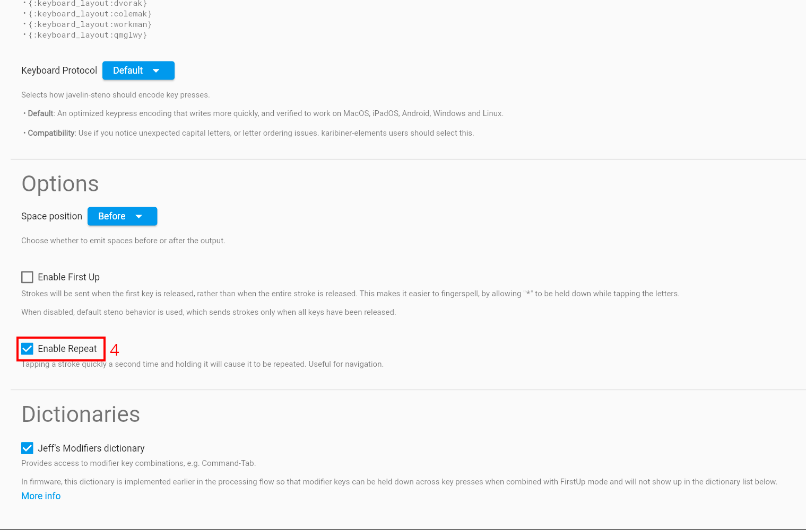
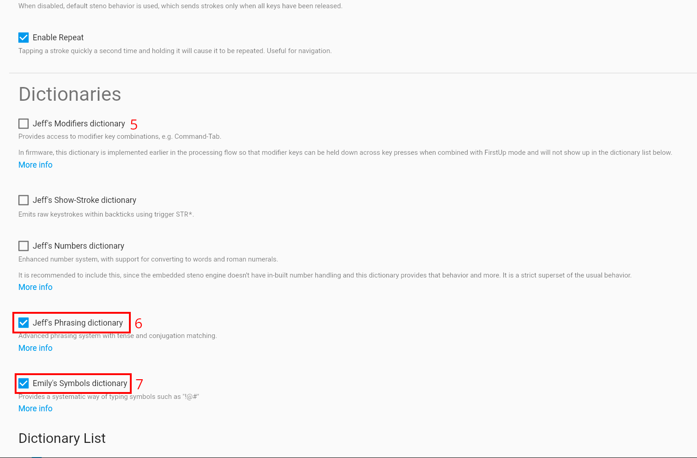

# Lapwing with Javelin

Javelin is a keyboard firmware that features an embedded steno engine. Embedded steno allows a keyboard to act as a steno machine without requiring any software installed on the host device. This is useful for using steno with locked down computers (i.e., school/work machines) or devices that do not support Plover (such as Chromebooks, iOS devices, Linux distros running Wayland, etc).

As this book is aimed towards Plover users, instructions specific to the Plover app will be found throughout the chapters. This page contains the afferent instructions for Javelin users in each chapter.

## Chapter 3

Chapter 3 provides instructions on using the Plover lookup tool. The [Javelin lookup tool](https://www.lim.au/#/software/steno-lookup/lapwing/) can also be used; follow the same tips for affix strokes.

There is also a [Javelin lookup tool for the onboard dictionaries](https://lim.au/#/software/javelin-steno-tools/lookup) in your steno keyboard. Although this requires connecting your steno keyboard, any translations you have added will show up here too.

## Chapter 4

Chapter 4 covers using Steno Jig to learn the layout. To use the Steno Jig layout drills with Javelin, go to the [active dictionaries](https://lim.au/#/software/javelin-steno-tools/active-dictionaries) and uncheck all the boxes:

> **NOTE:** it does not matter if the dictionaries for your device are different than those in the image above. Simply uncheck every single one.

This will make the steno keyboard output the raw keys (rather than any translations), which is necessary for these exercises. Once you have completed chapter 4, make sure to enable the dictionaries again.

## Chapter 5

Chapter 5 goes over setting up Lapwing with the Plover app. To set up Lapwing with Javelin, first go to the [Javelin Firmware Builder](https://lim.au/#/software/javelin-steno).

First select your hardware in the dropdown menu, and then press the <code class="code-mono">Default Lapwing</code> button. Scroll down to the very bottom of the page for specific instructions on flashing the firmware to your keyboard.

## Chapter 26

Chapter 26 discusses editing text, and brings up modal dictionaries. These are unfortunately not supported by Javelin. If you follow the set up instructions below, you will by default use the <code class="code-mono">lapwing-semi-modal-movement.json</code> dictionary. You can also experiment with first-up chord send or creating movement key layers.

# Creating your own Lapwing firmware

Instead of using the default Lapwing firmware, it is also possible to manually configure your own Javelin firmware for Lapwing. This may be helpful if you wish to tweak your layout or add your own personal dictionaries. As such, this guide is aimed towards advanced users. If you are new to steno and just want Lapwing on your board, follow the instructions for [chapter 5 above](#chapter-5).

## Download the dictionaries

Download the following dictionaries by right clicking the links and pressing <code class="code-mono">Save link as</code> (or whatever the equivalent is for your browser):

* [<code class="code-mono">lapwing-javelin-additions.json</code>](/javelin_dictionaries/lapwing-javelin-additions.json)
* [<code class="code-mono">abby-left-hand-modifiers.json</code>](/javelin_dictionaries/abby-left-hand-modifiers.json)
* [<code class="code-mono">emily-modifiers.json</code>](/javelin_dictionaries/emily-modifiers.json)
* [<code class="code-mono">lapwing-semi-modal-movement.json</code>](https://raw.githubusercontent.com/aerickt/steno-dictionaries/main/lapwing-semi-modal-movement.json)
* [<code class="code-mono">lapwing-commands.json</code>](https://raw.githubusercontent.com/aerickt/steno-dictionaries/main/lapwing-commands.json)
* [<code class="code-mono">lapwing-numbers.json</code>](https://raw.githubusercontent.com/aerickt/steno-dictionaries/main/lapwing-numbers.json)
* [<code class="code-mono">lapwing-uk-additions.json</code>](https://raw.githubusercontent.com/aerickt/steno-dictionaries/main/lapwing-uk-additions.json)
* [<code class="code-mono">lapwing-proper-nouns.json</code>](https://raw.githubusercontent.com/aerickt/steno-dictionaries/main/lapwing-proper-nouns.json)
* [<code class="code-mono">lapwing-base.json</code>](https://raw.githubusercontent.com/aerickt/steno-dictionaries/main/lapwing-base.json)

## Configure and build firmware

Go to the [Javelin Firmware Builder](https://lim.au/#/software/javelin-steno).

Select your hardware (1), enable expert options (2), and change the unicode mode (3) to whichever is applicable to your use case.

Scroll down to options, and select <code class="code-mono">Enable Repeat</code>(4).

In dictionaries, uncheck <code class="code-mono">Jeff's modifiers dictionary</code> (6), and enable <code class="code-mono">Jeff's phrasing dictionary</code> (7) as well as <code class="code-mono">Emily's symbols dictionary</code> (8).

In the dictionary list, add all the json dictionaries you downloaded earlier. Arrange them like shown below by dragging on the dictionary names.

> **NOTE:** make sure to uncheck the box next to `lapwing-semi-modal-movement.json`. This ensures the dictionary is disabled by default as it should only be enabled for movement commands.

In the key map settings, check <code class="code-mono">Use S1 as a #key</code> (8).

Finally, click on <code class="code-mono">Create Standalone</code> and follow the <code class="code-mono">Update Firmware</code> instructions in the section below. Note the instructions differ depending on the hardware you are using.

## Settings summary

| Number | Setting |
| ---- | ---- |
| 1 | Select the keyboard you want to use with Javelin |
| 2 | Enable <code class="code-mono">Show expert options</code> |
| 3 | Change the default unicode mode (depends on the OS you use most often) |
| 4 | Check <code class="code-mono">Enable repeat</code> |
| 5 | Uncheck <code class="code-mono">Jeff's modifiers dictionary</code> |
| 6 | Check <code class="code-mono">Jeff's modifiers dictionary</code> |
| 7 | Check <code class="code-mono">Emily's symbols dictionary</code> |
| 8 | Check <code class="code-mono">Use S1 as a #key</code> |

## Tweaking settings after the fact

Javelin has several useful [steno tools](https://lim.au/#/software/javelin-steno-tools) you can use to change various settings even after flashing the firmware. There is also a lookup tool and add translation tool just like with Plover.