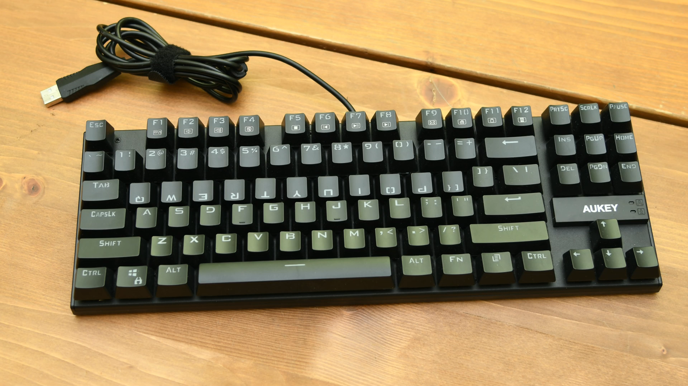

# Chapter 2: Steno hardware and software

Steno is unlike alternative keyboard layouts that can easily be switched in your operating system's settings. Steno requires specialized hardware and a steno engine that translates the keys you press into the words to be outputted. This chapter will go over both steno keyboards (hardware) and the software required.

## Steno hardware

I would highly recommend purchasing a *steno keyboard* before starting to learn steno. Any of the ones listed on the [supported hardware wiki page](https://plover.wiki/index.php/Supported_Hardware#Commercially_Available_Hobbyist_Machines) are really good; they will work for many years as you get faster.

$100 is a little steep for a simple keyboard, but that is unfortunately the price point for custom keyboards which don't see much demand.

There are two reasons why specialized keyboards are needed for steno. First of all, regular keyboards have row stagger making it difficult to press two keys at once with the same finger. Second of all, most keyboards lack *n-key rollover*: the ability to detect multiple simultaneous key presses. Standard keyboards are typically only able to detect two to six key presses at once.

That being said, the first steno board I ever used was an NKRO keyboard that I bought second hand for $30. It came with loud and heavy 60 gram switches. As you'll often be pressing around 6 keys per stroke, you want to have very light keys. With this cheap keyboard, I could only steno for about a minute before my wrists started burning. For comparison, professional *steno machines* have tension mechanisms that bottom out at as low as 10 grams regardless of how many keys are pressed.

If you do choose to use a regular keyboard for learning steno, make sure you know where the correct key positions are. I'd recommend printing out or keeping a graphic like this handy:

If possible, I would also recommend flipping the top row of keycaps to bring the top row a little closer to the bottom row. This helps a lot with pressing two keys vertically:

It is definitely possible to learn theory with a regular keyboard (even one that doesn't support n-key rollover), but it might be frustrating depending on your patience.

## Steno software

This series requires you to use *Plover*; a free and open source steno engine available on Linux, macOS, and Windows. Follow the instructions in the Plover wiki (link below) to set up the app and your machine. If you are using a QWERTY keyboard, make sure to read over the page and the relevant sections.

### [Beginner's Guide to Plover](https://plover.wiki/index.php/Beginner%27s_Guide)
