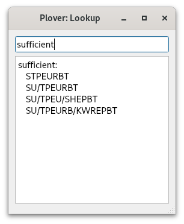
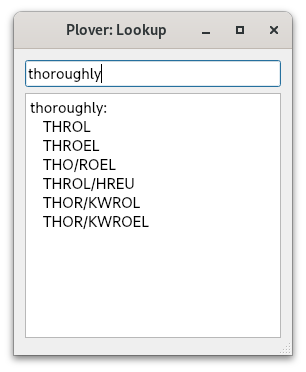
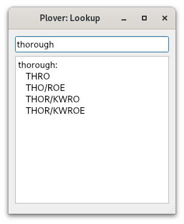

# Chapter 3: How to learn steno

## Steno is difficult

Before starting to learn steno, it is important to know that it is not something that can be easily picked up within a week. Personally, it took me about 3 months to achieve a consistent 30 WPM speed. While not nearly as difficult as learning a new language, the difficulty is definitely comparable to something like learning a musical instrument. Learning steno takes a lot of (good) practice and patience. You should not be expecting to double your typing speed in just a month.

In fact, it took me 6 months to reach 150 WPM on some TypeRacer quotes, but my speed varied quite a lot as novel and unfamiliar words would throw me off. While my top speed was indeed quite fast during this period, my average speed of 90 WPM wasn't significantly faster than a good QWERTY typist. Another 6 months later, I was at a consistent 180 WPM on most Monkeytype quotes. Another year and a half after that, I completely switched to steno for all computer tasks.

I hope reading this has not discouraged you from picking up steno, but I do have to honest and straightforward about it. If you are not discouraged, however, I do believe you have the right mindset to succeed!

## Take steno as a challenge!

When I first started learning stenography, I knew that people were saying it is very difficult to learn. Instead of being discouraged by this, it motivated me even more. In the back of my mind, I wanted to prove that steno wasn't that difficult and that maybe I could learn it faster than most people. While this is quite egotistical, I do think this mindset helped me along the way; even though I did not learn steno as fast as I had hoped.

If you're not feeling this way, but still want to learn, try to convince yourself that you can do this! Compared to other skills or technical abilities, steno is something that I truly believe anyone can do. You don't have to necessarily have quick fingers, and you don't have to have an exceptional memory. In my opinion, all you need is a lot of free time, some patience, and a good steno board.

I should also mention that if, at any point in your steno journey, you are feeling discouraged at your progress, don't give up! Most people take 6 months to a year to reach their old typing speed. It is a gradual process, and one that you should be finding fun.

Believe in yourself! Face learning steno as a challenge!

## How do I learn?

### Lapwing chapters

This series is aimed at being a complete guide to learning steno. While you will learn everything that you need to know to be fast at steno, practice and fluency is key.

Each chapter in this series follows the same basic format: new theory and practice material introduced in subsections followed by a chapter test. The purpose of this test is to ensure that you have learned the material well enough. It is crucial that you are comfortable and well acquainted with each chapter before moving onto the next.

Everyone's threshold of being "comfortable" differs and it is up to you to decide what this means for you. However, if you are unsure, the "recommended completion goal" is a good starting point.

**As this series is very new, I have not been given much feedback. As such, it may be possible that the recommended completion goal is entirely unrealistic for each chapter. Please take it with a grain of salt!**

### Chapter test recommendations

These are only recommendations if you have no idea where to start! It may very well be the case that you start off following some of these recommendations, and find out later on that they do not work for you.

Here are some tips for completing the tests:

* Before you attempt each chapter test, complete as much practice material as you can
* Space your chapter test attempt at least 2 hours after any previous practice
   * This ensures you are not simply testing your short-term memory
* If you don't meet your completion goal, self-reflect on whether this was due to a one-time careless mistake or not enough practice
   * If the former is the case, you may be ready to proceed to the next chapter
   * If the latter is the case, take a break and come back to the chapter another time!

### Incorporating steno into your computer usage

It's always a good idea to apply your learning to complement exercises in a textbook. However, I would only recommend incorporating steno into your computer usage after reaching chapter 18. If not, you will have to make liberal use of the lookup tool. It is very iportant to know how to use this tool correctly. If you blindly follow the entries that show up, you may find yourself confused and frustrated as to why a word is written the way it is. You may also force yourself to inadvertently memorize more briefs.

Plover has a built-in tool to easily look up outlines. It can be found in <code class="code-mono">Tools → Lookup</code>. Make sure to read the tips below if you would like to use this tool.

#### Use the longest outline available

Lapwing is full of briefs and write-outs. A brief is an *abbreviated* outline that is used for speed. It may not follow theory at all and can be completely arbitrary. On the other hand, write-outs are outlines that are logical and follow theory rules. Until you start speed building, you should focus on write-out entries.

Due to the nature of briefs and write-outs, briefs tend to use fewer strokes and write-outs tend to use more. When you type in a word into the lookup tool, both types of entries will be present. I recommend using the longest outline in the lookup tool as that is overwhelmingly likely to be a write-out.

In the following example, the first two entries are briefs, while the last two are write-outs. You should be using one of these two. Defaulting to the longest outline available is very safe.

#### Be careful of hidden affixes

The Lapwing dictionary may not contain every single valid outline. You will later learn of *affix strokes* which attach to root words. For example, the word "thoroughly" contains "thorough" as a road word and "^ly" as a *suffix*. One way to write "thoroughly" is `THOR/KWROE/HREU`. However, it does not show up in the dictionary:

Instead, remove the "^ly" suffix and look up the word "thorough". You will find `THOR/KWROE` as a valid outline:

To write the "^ly", you could look this up too:

The curly braces indicate that this word is special. In this case, the caret indicates that it will attach on that side. Putting these two outlines together, you would get `THOR/KWROE/HREU`. This is the canonical way you would write the word "thoroughly" even though it is not in the dictionary.

## Cold turkey?

In this context, going "cold turkey" with steno refers to throwing out your regular keyboard and switching to steno right away no matter how slow you are.

**I would not recommend this at all**

Going cold turkey might make sense if you're learning a new keyboard layout where you just have to learn the new key positions, but it doesn't work for steno. There are elements of theory that can only be learned from reading a book such as this one.

Ultimately, if you go cold turkey, you will find yourself looking up words very frequently. As a result, you will only be learning words by memorizing their outlines. While it is possible to deduce theory from these look ups, you will likely be frustrated and confused when it comes to less intuitive theory principles.

Instead, treat learning steno like a hobby on the side. Your ultimate goal may be to replace your regular keyboard with steno, but you need to at least be familiar with basic theory before doing so. Rushing will not get you anywhere in learning steno.
