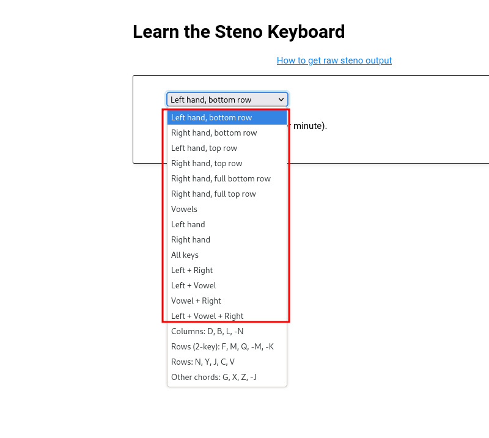
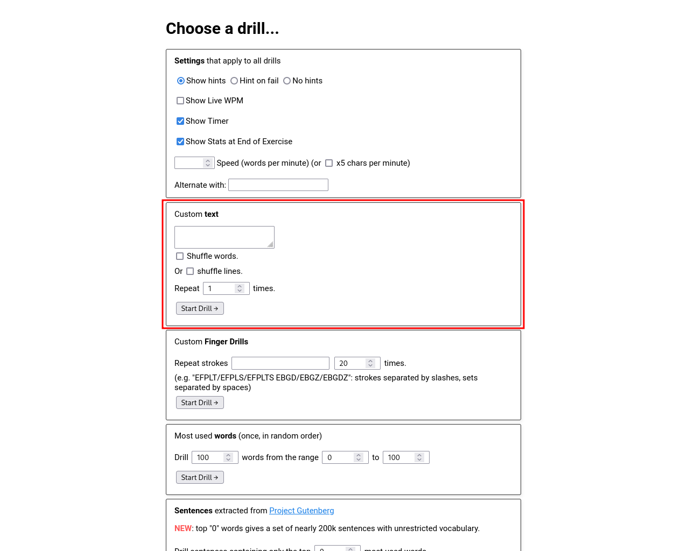
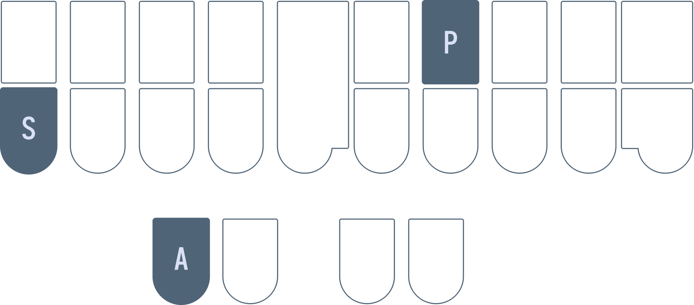

# Chapter 4: The layout

## Recommended pace

**Recommended time to spend on this chapter: 5–9 days**

1. Read this page (**10 minutes**)
2. Drill as much as possible over the course of several days (**1–3 hours**)
3. Attempt the [test](#chapter-4-test) (**20 minutes**)
   * Keep practising the test until you meet the requirements (**1 hour**)

## Useful links

  * [Steno Jig's "Learn the Steno Keyboard" Drills](https://joshuagrams.github.io/steno-jig/learn-keyboard.html)
  * [Steno Jig's Own Drills](https://joshuagrams.github.io/steno-jig/form.html)
* [Chapter 4 test](#chapter-4-test)

## Finger positions

Recall this graphic from chapter 2:


I recommend keeping this graphic in a convenient place to refer to. The yellow circles indicate the resting home position of your fingers. Your fingers should be curled and resting on the cracks of the keys. It's important to memorize this layout to the point that you are able to press the right key when prompted for.

The best way to go about memorizing this layout is splitting it into memorable chunks and doing a lot of drills. It's one thing to know which finger is responsible for which key(s), but the most effective way of building muscle memory for the layout is simply drilling it.

### The backspace key

From here on, you can play around with the keys and press random things to see what you get for fun. You could also jump right into the drills. In any case, it's very important to know how to backspace what Plover outputs. For this, press the asterisk key (`*`) and Plover will delete the last translation caused by the last stroke.

What's important to note is that doing so **does not delete the last word** necessarily. Try this: press the stroke `PAOEU` into a text editor. You should see the word "pie" outputted by Plover. Now, press the stroke `THOPB`. You should now see that Plover backspaces the "ie" and replaces it with "ython" to give you the word "python".

What you've just done is write a multistroke outline for the word "python"; to delete this, you will need to press the asterisk key twice. Try it out!

You can also watch this GIF:


Notice how pressing the asterisk once doesn't delete the word—it only deletes the last stroke and therefore leaves the `PAOEU` (pie) stroke alone.

For now, this isn't very crucial at the moment as the majority of words covered in these early chapters are written with one stroke. However, do keep in mind that the asterisk does not behave like a backspace key in the traditional sense.

## Steno Jig

> If you are using Javelin, make sure to read [Appendix C](Appendix-C.md#chapter-4) for instructions on setting up your keyboard with these drills.

For learning the layout, Steno Jig has some helpful ["Learn the Steno Keyboard"](https://joshuagrams.github.io/steno-jig/learn-keyboard.html) drills.

For each drill, you may choose to enable hints, which show where each key is located on the steno layout. Ultimately, you want to be able to do these drills without using any hints. Do not worry about the "Speed (strokes per minute)" parameter just yet.

If you are unsure where to start, these 5 drills are recommended (select them in the dropdown menu):

* Left hand, bottom row
* Right hand, full bottom row
* Left hand, top row
* Right hand, full top row
* Vowels

In order to do the drills, you must disable all your dictionaries by unchecking them in Plover's main window:


Click on the check marks next to each dictionary to disable them. After you've done this, Plover will output raw steno when you write a key. Simply press the key that is prompted during the drills. If you make a mistake, press the asterisk key to backspace.

### Why does Plover output a hyphen?

With your dictionaries unchecked, try pressing the right side "T" key (or really any consonant key on the right side). You'll notice that Plover outputs `-T` with a hyphen. The hyphen indicates that this "T" is on the right side of the keyboard. If you are prompted to press `S`, you must press the "S" key on the left side. If you see `-S`, this indicates that the S is on the right side and so you must press the right side "S" key.

This hyphen is included in all strokes that contain only right hand consonant keys. If you were to press the right hand "R", "P", and "L" keys, Plover would output `-RPL`. If a stroke contains a vowel or the asterisk, however, the hyphen is omitted. This syntax of raw steno makes it easy to differentiate repeat letter keys on both sides of the keyboard.

### How should I start?

If you'd like, you can just jump right into the drills; that is a valid way to learn the layout. However, I would suggest coming up with mnemonics first just to make the memorization process a little bit easier. These should be personal as they're more likely to stick.

For example, these are some mnemonics I used when first starting off:

1. Left hand, bottom row (`SKWR`)
   * <ins>s</ins>ome <ins>k</ins>ettle <ins>v</ins>alley <ins>r</ins>ailway (`SKWR`)
     * A historical railway in my area ("v" is not quite "W", but it was close enough)

2. Right hand, full bottom row (`-RBGSZ`)
    * <ins>r</ins>ed, <ins>b</ins>lue, <ins>g</ins>reen (`RBG`)
      * Like "RGB" but not quite
   * Bottom right pinkie key is `-S` just like bottom left pinkie
   * The "Z" sound is similar to "S" and is immediately to the right of `-S`
   * `-Z` is also on the end, just like in the alphabet

3. Left hand, top row (`#TPH`)
   * ha<ins>s</ins>h is right above `S`
   * <ins>t</ins>he <ins>p</ins>ower of <ins>h</ins>ydrogen ("TPH")
     * As in the chemistry term "pH"

4. Right hand, full top row (`-FPLTD`)
   * Index <ins>f</ins>inger presses `-F`
   * <ins>p</ins>ersonal <ins>l</ins>earning <ins>t</ins>ime (`-PLT`)
     * You can also combine the previous key with this mnemonic where `-F` represents an expletive (`-FPLTD`)
   * The "D" sound is just the voiced "T" sound and is right next to `-T` (`-D`)


5. Vowels (`AOEU`)
   * <ins>a</ins>y y<ins>o</ins>, <ins>eu</ins>! (`AOEU`)
     * An individual really passionate about the European Union
   * You could also pronounce "ao" as "ow" for someone who dislikes the European Union

Clearly some of these mnemonics are rather silly (and also very specific), but that makes them easier to remember for me. I do encourage you to come up with your own! At some point, the keys will become natural to you and you will not need to recall any mnemonics. **It is at this point that you should proceed to the test.**

### Other drills

If, after a few days, you feel pretty comfortable practising the [previous drills](#steno-jig), you may want to try other practice material. The [other Steno Jig drills](https://joshuagrams.github.io/steno-jig/learn-keyboard.html) are fair game:



The drills outside of the red box incorporate theory you have not learned yet, and are not recommended.

If you have already done these drills and are quite comfortable, I would recommend moving onto the test.

## Chapter 4 test

For this test, we will also be using Steno Jig. This time, we will be making a custom drill here:



[Click here](https://joshuagrams.github.io/steno-jig/form.html) to take you to the page shown above.

Copy and paste the following into the text box:

```
SAF SAR SAP SAB SAL SAG SAT SAS SAD SAZ SOF SOR SOP SOB SOL SOG SOT SOS SOD SOZ SEF SER SEP SEB SEL SEG SET SES SED SEZ SUF SUR SUP SUB SUL SUG SUT SUS SUD SUZ TAF TAR TAP TAB TAL TAG TAT TAS TAD TAZ TOF TOR TOP TOB TOL TOG TOT TOS TOD TOZ TEF TER TEP TEB TEL TEG TET TES TED TEZ TUF TUR TUP TUB TUL TUG TUT TUS TUD TUZ KAF KAR KAP KAB KAL KAG KAT KAS KAD KAZ KOF KOR KOP KOB KOL KOG KOT KOS KOD KOZ KEF KER KEP KEB KEL KEG KET KES KED KEZ KUF KUR KUP KUB KUL KUG KUT KUS KUD KUZ PAF PAR PAP PAB PAL PAG PAT PAS PAD PAZ POF POR POP POB POL POG POT POS POD POZ PEF PER PEP PEB PEL PEG PET PES PED PEZ PUF PUR PUP PUB PUL PUG PUT PUS PUD PUZ WAF WAR WAP WAB WAL WAG WAT WAS WAD WAZ WOF WOR WOP WOB WOL WOG WOT WOS WOD WOZ WEF WER WEP WEB WEL WEG WET WES WED WEZ WUF WUR WUP WUB WUL WUG WUT WUS WUD WUZ HAF HAR HAP HAB HAL HAG HAT HAS HAD HAZ HOF HOR HOP HOB HOL HOG HOT HOS HOD HOZ HEF HER HEP HEB HEL HEG HET HES HED HEZ HUF HUR HUP HUB HUL HUG HUT HUS HUD HUZ RAF RAR RAP RAB RAL RAG RAT RAS RAD RAZ ROF ROR ROP ROB ROL ROG ROT ROS ROD ROZ REF RER REP REB REL REG RET RES RED REZ RUF RUR RUP RUB RUL RUG RUT RUS RUD RUZ
```

This test is a little different to previous drills in that you are writing entire strokes rather than single keys. Consonants on the left side of a vowel should be pressed with the left hand, and consonants on the right side should be pressed with the right hand. So `SAP` would be written like:



**It is important that you press all three keys all at once for every stroke you are prompted to write (do not press each key letter by letter).**

Select "Shuffle words" and make sure your dictionaries are also unchecked just like in previous drills. Once you have done so, you are ready to go!

#### Recommended completion goal

This is only a suggestion; it is not a requirement to move to the next chapter!

**You should be able to complete this test in 15 minutes or fewer with an accuracy of at least 90%.**

This bar for completion is quite high, relatively speaking. However, do keep in mind that spending a week or more on the layout is recommended! It is very important that you internalize the layout as much as possible.

**You are encouraged to use this test material as practice!**
