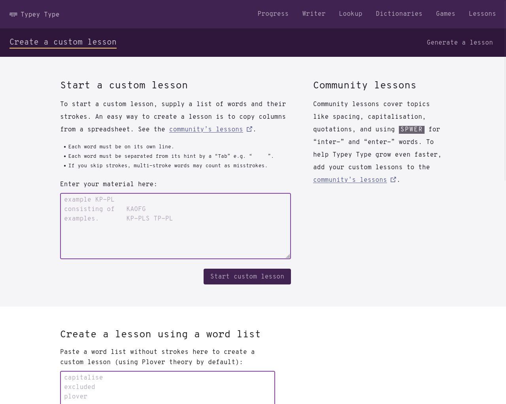
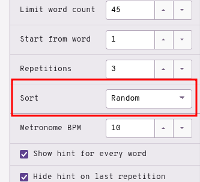
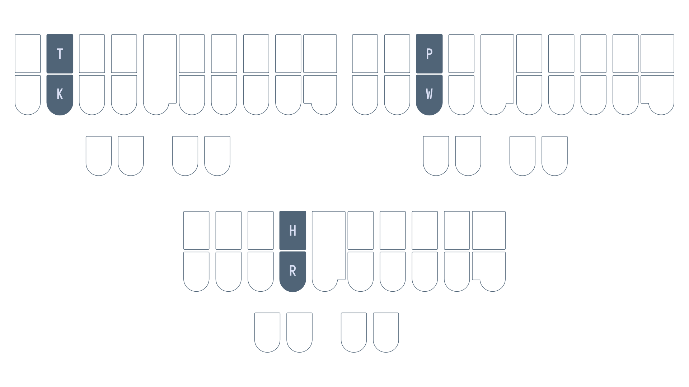

# Chapter 5: Lapwing setup and basics

## Recommended pace

**Recommended time to spend on this chapter: 2–5 days.**

1. Set up [Lapwing](#lapwing-setup) (**5 minutes**)
2. Familiarize yourself with [Typey Type](#typey-type) (**5 minutes**)
   * Play around with various settings if you'd like
3. Read [Basic phonetics—single syllable words](#basic-phoneticssingle-syllable-words) and complete the drill (**20 minutes**)
   * Repeat the drill as needed.
4. Read [The missing short vowel](#the-missing-short-vowel) and complete the drill (**15 minutes**)
   * Repeat the drill as needed
5. Read [Left hand d, b, and l](#left-hand-d-b-and-l) and complete the drill (**20 minutes**)
6. Attempt the [test](#chapter-5-test) (**20 minutes**)
   * Practise as needed

Remember to take breaks!

## Useful links

* [Typey Type custom lessons](https://didoesdigital.com/typey-type/lessons/custom/setup)
* [Basic single syllable words drill](practice/5-cvc.txt)
* [Basic left hand single syllable words drill](practice/5-basic-left-hand.txt)
* [Single syllable words with `EU` drill](practice/5-EU.txt)
* [Single syllable dbl words drill](practice/5-dbl.txt)
* [Chapter 5 test](practice/5-test.txt)

## Lapwing setup
The Plover app comes loaded with a default theory called Plover theory. As this series is for learning Lapwing theory, there are a few modifications needed before proceeding. There are two options: install the <code class="code-mono">plover-lapwing-aio</code> plugin, or add the Lapwing dictionaries manually (not recommended). If in doubt, follow the instructions below for the all-in-one plugin as discussed below.

### Using the all-in-one plugin

In Plover's main window, click on <code class="code-mono">Tools → Plugins Manager</code>. Scroll down until you see <code class="code-mono">plover-lapwing-aio</code> and select it. Press <code class="code-mono">Install/Update</code> and make sure to press the <code class="code-mono">Restart</code> button afterwards.

> **NOTE:** just closing the main window is not sufficient to restart Plover. **You will have to press the restart button or manually quit Plover by going to <code class="code-mono">File → Quit Plover</code> and opening Plover again.**

Once Plover has been restarted, in Plover's main window, click on <code class="code-mono">Configure → System</code> and change the system to <code class="code-mono">Lapwing</code>. Press <code class="code-mono">Apply</code> and <code class="code-mono">OK</code>—you should now be good to go!

> If you'd like to know more about the default dictionaries that come with the all-in-one plugin, have a look at the [homepage](https://github.com/aerickt/plover-lapwing-aio).

### Setting up Lapwing manually

If you do not want to use the all-in-one plugin, please see [Appendix B](Appendix-B.md) if you wish to set up Lapwing dictionaries manually (not recommended).

## Typey Type

From this point on, exercises will be done on Typey Type. The benefit is that custom lessons with their own recommended outlines can be configured.

### [Click here to access Typey Type shown above](https://didoesdigital.com/typey-type/lessons/custom/setup)

Lessons in this series will be provided as links to text files. Left clicking on these links will display the contents of each lesson. Copy and paste the entire file (<code class="code-mono">Ctrl + A</code> or <code class="code-mono">Cmd + A</code>  to select the whole page) into the text box above. After that, press <code class="code-mono">Start custom lesson</code>.

**Make sure to sort the words randomly on the right hand side.**

You may tweak additional settings to your liking, but the defaults are perfectly fine. If you would like to try this out, here is one example of a lesson:

[Click here to access a sample lesson](practice/5-cvc.txt)

## Basic phonetics—single syllable words

In the previous chapter's test, you had to write all the different combinations of strokes that involve a left hand consonant, a vowel, and a right hand consonant. You may have noticed that some of these strokes actually resemble words like `POT`, `TAP`, and `HUT`. In Lapwing theory, this is exactly how you would write the words "pot", "tap", and "hut", respectively.

The reason for this is:

**Every key represents the sound it is labelled with (unless it is part of a chord).**

> This means that the `P` in `POT` represents the "p" sound. However, the `P` in `TPAUT` does not represent the "p" sound since it is part of the `TP` chord. Do not worry about identifying chords for now.

Here are some examples of some basic words that can be written just by knowing the layout:

* cat `KAT`
* rub `RUB`
* purr `PUR`
* rough `RUF`

Those last two words may have been a little bit tricky as their spellings contain multiple vowel letters. Here are some rules for dealing with *short vowels*:

1. **If a word is spelled using a single vowel, use the vowel key that spells the word.**

2. **If a word is spelled using multiple vowel letters that (together) are pronounced as a single short vowel, use the vowel key that corresponds to the sound.**

### Different vowels with `-R`?

The words "purr" and "rub" have phonetically different vowels and yet still use the same vowel keys.

This is not limited to the `U` vowel; for example, we see this in:

* `AR` as in "c<ins>ar</ins>"
* `OR` as in "t<ins>or</ins>e"
* `ER` as in "p<ins>er</ins>"
* `UR` as in "p<ins>urr</ins>"

Remember that with short vowels, spellings are used instead of pronunciation (rule 1 above).

### Section practice material

[Basic single syllable words drill](practice/5-cvc.txt)

## Steno order

Looking at the steno layout, why is it that "car" must be written using the left `K`, and the right hand `-R`?

The answer is *steno order*.

Sounds you make on the layout are supposed to follow this order.

**#STKPWHRAO\*EUFRPBLGTSDZ**

Therefore, the only correct way to write the word "car" would be  `KAR`.

**#ST<ins>K</ins>PWHR<ins>A</ins>O\*EUF<ins>R</ins>PBLGTSDZ**

The following is an incorrect way to write "car"; it is actually `KRA`:

It's not necessary to memorize steno order explicitly (as in the `#STKPWHRAO*EUFRPBLGTSDZ` string). However, it's important to internalize steno order with regard to the location of the keys. With enough practice, it should be immediately obvious that the "-st" sound as in "past", for example, cannot be represented in steno order.

### Impossible single syllable words

Below are two single syllable words that cannot be written in one stroke because of steno order.

* trust
   - Closest would be `TRUTS`
   - #S<ins>T</ins>KPWH<ins>R</ins>AO*E<ins>U</ins>PBLG<ins>TS</ins>DZ
* turf
   - Closest would be `TUFR`
   - #S<ins>T</ins>KPWHRAO*E<ins>UFR</ins>PBLGTSDZ

To represent a sound in a steno stroke, the sounds should be available on the layout and should fall in the correct order. Although the sounds are indeed available on the layout, they fail the second requirement. For now, do not worry about writing these words—they involve more advanced chords and concepts that will be introduced later.

## Combining single left hand keys

Before even learning some of the more complicated chords, there are some sounds on the left hand that can be combined together quite intuitively.

* `ST` as in "<ins>st</ins>op"
* `SK` as in "<ins>sc</ins>ar"
* `SP` as in "<ins>sp</ins>ot"
* `SH` as in "<ins>sh</ins>op"
* `TH` as in "<ins>th</ins>ug"
* `TR` as in "<ins>tr</ins>ap"
* `KH` as in "<ins>ch</ins>ug"
* `KR` as in "<ins>cr</ins>op"
* `PR` as in "<ins>pr</ins>at"

> `KH` for "ch" might not be immediately obvious, but just remember that `K` is used for the "hard c" sound. Thus, if you accept that `K` can represent the letter "c", then combining it with the `H` key makes some sense.

### Section practice

[Basic left hand single syllable words](practice/5-basic-left-hand.txt)

## The missing short vowel

There are 5 short vowels, and you may have noticed that there is no `I` key. It's instead chorded with `EU`.

### Examples

* krill `KREUL`
* pit `PEUT`
* sir `SEUR`*
* tip `TEUP`

> \*Phonetically, "sir" has a different vowel sound to all the other examples. However, remember that this is accepted with our short vowel rules; we don't necessarily care about the sound if it is a short vowel.

### Section practice
[Single syllable words with `EU`](practice/5-EU.txt)

## Left hand d, b, and l

* `TK` is "d" as in "<ins>d</ins>ab"
* `PW` is "b" as in "<ins>b</ins>ot"
* `HR` is "l" as in "<ins>l</ins>et"

### Examples

* dad `TKAD`
* bar `PWAR`
* lap `HRAP`
* bled `PWHRED`

### Mnemonics

> Feel free to come up with your own or even suggest some!

1. Each of these chords are simply two keys in a column
   * `TK` is pressed by the left hand ring finger
   * `PW` is pressed by the left hand middle finger
   * `HR` is pressed by the left hand index finger
2. Think "DBL"
   * <ins>d</ins>ou<ins>bl</ins>e (these are *double* keys)
     * From [Art of Chording](https://www.artofchording.com)
   * <ins>d</ins>eci<ins>b</ins>e<ins>l</ins>
   * <ins>d</ins>ata<ins>b</ins>ase <ins>l</ins>over

### Section practice
[Single syllable dbl words](practice/5-dbl.txt)

## Chapter 5 test

This chapter's test consists of all the practice drills you have done so far in this chapter. Make sure your settings are configured as such:

* Limit word count: 45
* Start from word: 1
* Repetitions: 3
* Sort: random
* Show hint for every word: unchecked
* Hide hint on last repetition: unchecked
* Show hint on misstroke: checked

[Click here to access the chapter 5 test](practice/5-test.txt)

### Recommended completion goal

This is only a suggestion; it is not a requirement to move to the next chapter!

**Aim for 10–20 WPM with 90% accuracy.**

**You may use the test material as practice!**
