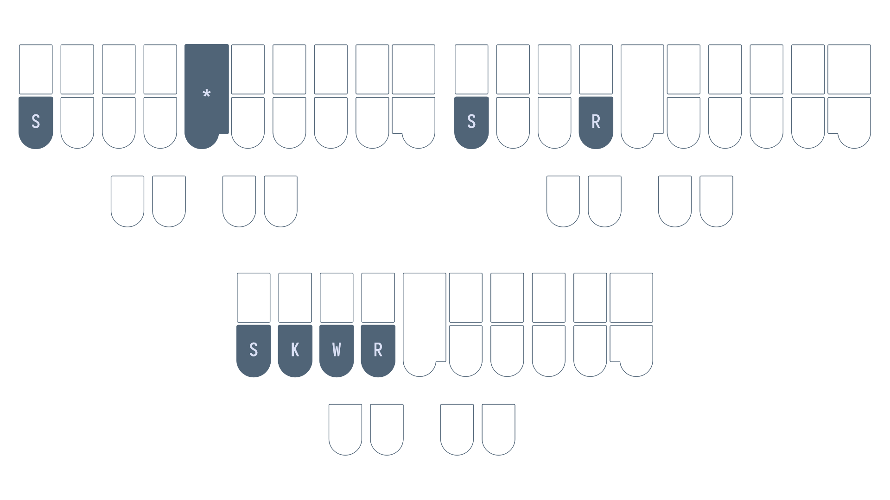

# Chapter 6: Left hand consonants continued

## Recommended pace

**Recommended time to spend on this chapter: 2–5 days.**

1. Read [Left hand f, q, and m](#left-hand-f-q-and-m) and complete the drill (**20 minutes**)
   - Repeat the drill as needed
2. Read [left hand g, n, and y](#left-hand-g-n-and-y) and complete the drill (**20 minutes**)
   - Repeat the drill as needed
3. Read [left hand z, v, and j](#left-hand-z-v-and-j) and complete the drill (**20 minutes**)
   - Repeat the drill as needed
4. Attempt the [test](#chapter-6-test) (**20 minutes**)
   * Practise as needed

Remember to take breaks!

## Useful links

* [Single syllable fqm words drill](practice/6-fqm.txt)
* [Single syllable gny words drill](practice/6-gny.txt)
* [Single syllable zvj words drill](practice/6-zvj.txt)
* [Chapter 6 test](practice/6-test.txt)

## Left hand f, q, and m

* `TP` is "f" as in "<ins>f</ins>ad"
* `KW` is "q" as in "<ins>q</ins>uit"
* `PH` is "m" as in "<ins>m</ins>od"

### Wouldn't `PH` as "f" make more sense? 

Why not use `PH` for "f"?. After all, this would be easier to remember since "ph" has the same sound as "f". However, it would be impossible to chord "fl" sounds as the `PH` and `HR` chords overlap. `PHR` already represents the initial "pl" consonants. We would run into ambiguity if we also defined `PHR` to be the "fl" consonants (e.g., "plat" and flat").

### Examples

* far `TPAR`
* flat `TPHRAT`
* quill `KWEUL`
* quip `KWEUP`
* met `PHET`
* more `PHOR`

### Mnemonics

> Feel free to come up with your own or even suggest some!

1. Each of these chords are simply two keys in a row
   * `TP` is the top row pressed by the ring and middle fingers
   * `KW` is the bottom row pressed by the ring and middle fingers
   * `PH` is the top row pressed by the middle and index fingers
2. Think "FQM" in steno order (top to bottom, left to right!)
   * <ins>f</ins>ully <ins>q</ins>ualified <ins>m</ins>ountain
   * <ins>f</ins>irst <ins>q</ins>uill <ins>m</ins>ade

### Section practice

[Single syllable fqm words](practice/6-fqm.txt)

## Left hand g, n, and y

* `TKPW` is "g" as in "<ins>g</ins>et"

> **NOTE:** `TKPW` is only used for the "hard g" sound. For example, the word "gel" would not use `TKPW` as the initial consonant is not a "soft g" (a "j" sound).

* `TPH` is "n" as in "<ins>n</ins>ot"
* `KWR*` is "y" as in "<ins>y</ins>et"
  * `KWR` is pressed using the left hand ring, middle, and index fingers

> If you use Plover's lookup tool, you will notice that a lot of words beginning with "y" can be written using `KWR` (without the asterisk). It's recommended that you **don't** use these outlines.

**`KWR*` is only used when the word starts with the letter "y"; if a word has a "y" sound but doesn't start with a "y", simply don't use a left hand consonant chord.**

### Examples

* gloss `TKPWHROS`
* gull `TKPWUL`
* nap `TPHAP`
* net `TPHET`
* yeet `KWRAO*ET`
* yes `KWR*ES`
* use `AOUS`

### Mnemonics

> Feel free to come up with your own or even suggest some!

1. `TKPW` is a group of 4 keys pressed by the ring and middle fingers
2. `TPH` is a row of 3 keys pressed by the ring, middle, and index fingers
3. `KWR*` is a row of 4 keys composed of the left hand ring, middle, and index fingers and the right hand index finger (optional)
   
### Section practice

[Single syllable gny words](practice/6-gny.txt)

## Left hand z, v, and j

* `S*` is "z" as in "zit"
* `SR` is "v" as in "vat"
* `SKWR` is "j" as in "job"

### Mnemonics

> Feel free to come up with your own or even suggest some!

1. The "z" sound is similar to the "s" sound and thus they only differ in the asterisk key
2. The chemical element strontium (symbol <ins>Sr</ins>) is not <ins>v</ins>anadium
3. `SKWR` is just the bottom row of the left hand

### Examples

* zap `SA*P`
* zip `S*EUP`
* var `SRAR`
* ver `SRER`
* jib `SKWREUB`
* jot `SKWROT`

### Section practice

[Single syllable zvj words](practice/6-zvj.txt)

## Chapter 6 test

This chapter's test consists of all the practice drills in this chapter. Make sure your settings are configured as such:

* Limit word count: 45
* Start from word: 1
* Repetitions: 3
* Sort: random
* Show hint for every word: unchecked
* Hide hint on last repetition: unchecked
* Show hint on misstroke: checked

[Click here to access the chapter 6 test](practice/6-test.txt)

### Recommended completion goal

This is only a suggestion; it is not a requirement to move to the next chapter!

**Aim for 10–20 WPM with 90% accuracy.**

**You may use the test material as practice!**
