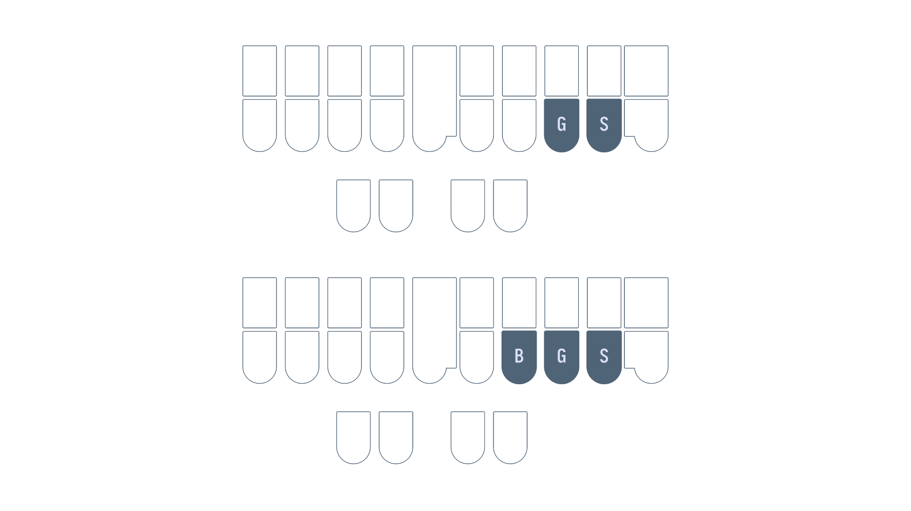
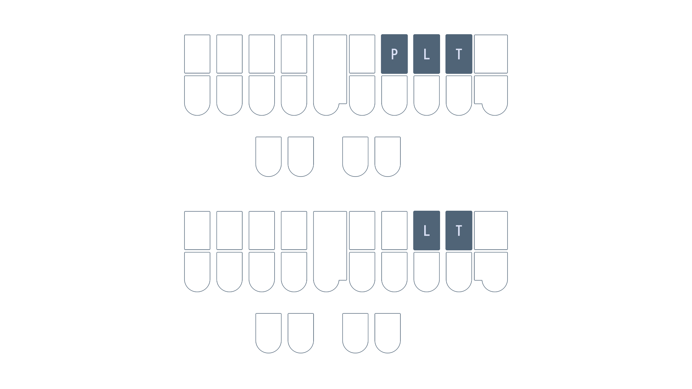

# Chapter 11: Right hand compound clusters

## Useful links

* [Right hand -shun, -kshun, and -x words](practice/11-right-shun-kshun-and-x.txt)
* [Right hand -ment and -let words drill](practice/11-right-ment-and-let.txt)
* [Right hand `-BL` words drill](practice/11-right-BL-BLT.txt)
* [Right hand -shus and -shal words drill](practice/11-right-shus-and-shal.txt)
* [Chapter 11 test](practice/11-test.txt)

## Intro

All the chords covered so far represent single sounds. However, there are some chords (particularly on the right hand) that can represent multiple syllables. These are referred to as compound clusters.

## Right hand -shun, -kshun, and -x

* `-GS` is "-shun" as in "o<ins>cean</ins>"
* `-BGS` represents two sounds:
  - "-x" as in "ta<ins>x</ins>"
  - "-kshun" as in "fri<ins>ction</ins>"

### Examples
* motion `PHOEGS`
* caution `KAUGS`
* fax `TPABGS`
* tex `TEBGS`

### -kshun and -x conflicts
Some words like "a<ins>x</ins>e" and "a<ins>ction</ins>" conflict with the same outline: `ABGS`. In these cases, the "-x" sound is given higher priority and "-kshun" sound is relegated to `*BGS` (same chord, but with the asterisk key).

#### Examples

* faction `TPA*BGS` (since `TPABGS` is already "fax")
* section `S*EBGS` (since `SEBGS` is already "sex")

### Mnemonics:

> Feel free to come up with your own or even suggest some!

1. "mu<ins>gs</ins> in the o<ins>cean</ins>"
2. `-BGS` as the "-x" chord is simply just the combination of the "-k" chord `-BG` and the `-S` key
3. `-BGS` as the "-kshun" chord overlaps with the "-k" chord `-BG` and the "-shun" chord `-GS`

### Section practice

[Right hand shun, kshun, and x words](practice/11-right-shun-kshun-and-x.txt)

## Right hand -ment and -let

* `-PLT` is "-ment" as in "mo<ins>ment</ins>"
* `-LT` is "-let" as in "scar<ins>let</ins>"

### Examples
* garment `TKPWARPLT`
* torment `TORPLT`
* roulette `RAOULT`
* wallet `WAULT`

### Mnemonics:

> Feel free to come up with your own or even suggest some!

1. Taking the middle out of "ment" gives "mt" which is what `-PLT` represents
2. Taking the middle out of "let" gives "lt" which is what `-LT` represents

### Section practice

[Right hand -ment and -let words](practice/11-right-ment-and-let.txt)

Unfortunately, there is not a lot of practice material for single stroke words containing these chords.

## Right hand `-BL` and `-BLT`

* `-BL` represents the "-bl" sound as in "glo<ins>bal</ins>"
   - When this sound is preceded by a vowel, the `-BL` chord can be extended to represent the whole sound as in:
      - "pli<ins>able</ins>"
      - "poss<ins>ible</ins>"
* `-BLT` represents the "-bility" sound as in "sta<ins>bility</ins>"
   - When this sound is preceded by a vowel, the `-BLT` chord can be extended to represent the whole sound as in:
      - "cap<ins>ability</ins>"
      - "feas<ins>ibility</ins>"

### Examples

* rebel `REBL`
* playable `PHRAEUBL`
* terrible `TERBL`
* mobility `PHOEBLT`
* viability `SRAOEUBLT`

### Mnemonics:

> Feel free to come up with your own or even suggest some!

1. `-BL` already looks a lot like the sounds it represents, it just sometimes skips over an unemphasized vowel.
1. `-BLT` is just building off of `-BL` with a "i**t**y" sound.

### Section practice

[Right hand `-BL` and `-BLT` words drill](practice/11-right-BL-BLT.txt)

## Right hand -shus and -shal

* `-RBS` is the "shus" sound as in "cau<ins>tious</ins>"
* `-RBL` is the "shal" sound as in "so<ins>cial</ins>"

### Examples

* nauseous `TPHAURBS`
* precious `PRERBS`
* facial `TPAEURBL`
* special `SPERBL`

### Section practice

[Right hand -shus and -shal words drill](practice/11-right-shus-and-shal.txt)

Unfortunately, there is not a lot of practice material for single stroke words containing these chords.

## Chapter 11 test

This chapter's test consists of all the practice drills in this chapter. Make sure your settings are configured as such:

* Limit word count: 45
* Start from word: 1
* Repetitions: 3
* Sort: random
* Show hint for every word: unchecked
* Hide hint on last repetition: unchecked
* Show hint on misstroke: checked

[Click here to access the chapter 11 test](practice/11-test.txt)

### Recommended completion goal

This is only a suggestion if you are unsure of when to move on to the next chapter; it is not a strict requirement!

**Aim for 10–20 WPM with 90% accuracy.**

**You may use the test material as practice!**

## Chapter briefs

> This section is completely optional, but recommended. If you prefer to learn these all at once, they will be covered in chapter 16.

| Translation | Brief | Explanation |
| ---- | ---- | ---- |
| every | `EFR` | <ins>ev</ins>e<ins>r</ins>y |
| first | `TPEUFRT` | Uses an inversion of steno order (`-R` and `-F` are swapped) with the `-F` representing "s" |
| follow | `TPOL` | <ins>fol</ins>low |
| where | `W-R` | <ins>w</ins>he<ins>r</ins>e |
| could | `KUD` | |
| would | `WUD` | |
| should | `SHUD` | |
| through | `THRU` | `THRAOU` is the word "threw" |

> **NOTE:** remember that these are briefs; the explanations are not applicable to any arbitrary word.

### Practice sentences
1. should you follow them?
1. could we first pass through?
1. would you know every place?
1. where are they?

#### Answers
1. `SHUD/U/TPOL/THEPL/KW-PL`
1. `KUD/WAOE/TPEUFRT/PAS/THRU/KW-PL`
1. `WUD/U/TPHOE/EFR/PHRAEUS/KW-PL`
1. `W-R/-R/THE/KW-PL`

### Extra briefs

| Brief | Outline | Explanation |
| ---- | ---- | ---- |
| everyone | `EFRPB` | `EFR` + `-PB` |
| everywhere | `WEFRB` | `EFR` + `W-R` |
| where the | `W-RT` | `W-R` + `-T` |
| through the | `THRUT` | `THRU` + `-T` |
