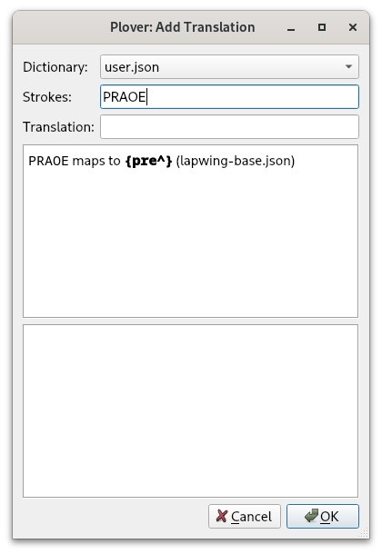

# Chapter 13: Prefixes and suffixes

## Recommended pace

**Recommended time to spend on this chapter: 2–5 days.**

1. Read [Prefix strokes](#prefix-strokes) (**20 minutes**)
2. Read [Suffix strokes](#suffix-strokes) and complete the drills (**60 minutes**)
   - Repeat the drills as needed
3. Read [Prefix priority](#prefix-priority) (**5 minutes**)
4. Attempt the [test](#chapter-13-test) (**20 minutes**)
   * Practise as needed

Remember to take breaks!

## Useful links

* [Words with -y and -ly suffixes drill](practice/13-eu.txt)
* [Words with -ar, -or, and -er suffixes drill](practice/13-ar-or-er.txt)
* [Words with -ful and -ness suffixes drill](practice/13-ful-ness.txt)
* [Right hand ment and let words](practice/11-rh-ment-and-let.txt)
* [Right hand bl words drill](practice/11-rh-bl.txt)
* [Right hand kwr suffix words drill](practice/13-kwr.txt)
* [Right hand \*bility words drill](practice/13-rh-bility.txt)
* [Chapter 13 test](practice/13-test.txt)

## Intro

Every chapter up until now has been focusing on single syllable words. When it comes to words with more than one syllable, we simply just break these into multiple strokes. How exactly we do this depends on the situation. We will first look at more straightforward situations in this chapter.

## Prefix strokes

Every translation we have been writing so far has been a regular word with no special formatting. This means that Plover will output a space before every word—this should be pretty familiar to you from the drills we have been practising. Let's take a look at how Plover parses these translations. In the main window of Plover, go to <code class="code-mono">Tools → Add Translation</code>. With your steno keyboard, write <code class="code-mono">STROEBG</code> into the <code class="code-mono">Strokes</code> field. You should see the following:

Now let's look at a **prefix stroke**. This is a stroke that tells Plover to suppress the next space after outputting a translation. If you write `PRAOE` into the <code class="code-mono">Strokes</code> field. You should see the following:

Here, the curly braces denote that there is special formatting rules contained inside the braces. The caret tells Plover to suppress the space where it is located. Any translation of the form ___^ is a prefix.

If you were to write the word "preview", you would have to split this word into "pre^" + "view". Try it yourself—open a text document and write the strokes `PRAOE` and then `SRAOU`. In raw steno, this would be notated as `PRAOE/SRAOU` with the `/` character representing a stroke separator.

Most prefix strokes are fairly intuitive and take precedence when they conflict with other translations. For example, the "for^" prefix as in "forget" `TPOR/TKPWET` is written as `TPOR` while the word "for" is briefed. Thus, it's not necessary to memorize many of these strokes.

### Common Prefix Strokes

* a^ `A`
  - As in "<ins>a</ins>bout" `A/PWOUT`
* co^ `KOE`
  - As in "<ins>co</ins>star" `KOE/STAR`
* de^ `TKAOE`
  - As in "<ins>de</ins>plane" `TKAOE/PHRAEPB`
* for^ `TPOR`
  - As in "<ins>for</ins>go" `TPOR/TKPWOE`
* in^ `EUPB`
  - As in "<ins>in</ins>fix" `EUPB/TPEUBGS`
* mis^ `PHEUS`
  - As in "<ins>mis</ins>take" `PHEUS/TAEUBG`
* non^ `TPHOPB`
  - As in "<ins>non</ins>stop" `TPHOPB/STOP`
* pro^ `PROE`
  - As in "<ins>pro</ins>tip" `PROE/TEUP`
* re^ `RAOE`
  - As in "<ins>re</ins>take" `RAOE/TAEUBG`
* sub^ `SUB`
  - As in "<ins>sub</ins>way" `SUB/WAEU`

### Prefix usage

Let's say you are trying to write the word "confuse". You may be tempted to write `KOPB/TPAOUS`, but you would have to know if `KOPB` is a prefix stroke. Even if it were, it wouldn't make sense to use it since "fuse" isn't the root word of "confuse"—the two words aren't related in meaning. Instead, you will later learn another method you should actually be using to write this word.

**For now, only use prefix strokes when they make sense semantically. A prefix stroke should modify a root word that can exist on its own.**

### Prefixes with different pronunciations

English pronunciation differs from person to person, but even a single speaker may pronounce a word differently depending on the context. For example, you may pronounce the word "defect" as `TKAOE/TPEBGT` (as the noun) or `TKE/TPEBGT` (as the verb). Both of these outlines are valid and you will find this to be the case with many ambiguous situations.

Here is a non-exhaustive list of some alternative prefix strokes:

* "de-" `TKE`
* "pre-" `PRE`
* "pro-" `PRO`
* "re-" `RE`

This chapter later covers [looking up prefixes and suffixes](#looking-up-prefixes-and-suffixes) which is handy for finding these alternative prefix strokes.

### Practice material?

There is no practice material for this section. It's not important to explicitly know and memorize prefix strokes as they tend to be implicitly used with the syllabic splitting technique, which you will learn in a later chapter.

## Suffix strokes

Much like how a prefix stroke attaches to the next word, a suffix stroke attaches to the **previous** word—it's exactly what you might expect from the name. Unlike prefix strokes, however, suffixes tend to be less intuitive and most have to be memorized. This section is split into smaller subsections with different "families" of suffix strokes to hopefully make them easier to remember.

It is very important that you understand when it is appropriate to use a suffix. Pay careful attention to the information in each subsection telling you when it is appropriate to use those suffix strokes.

### `EU` suffixes

The suffixes in this subsection contain the `EU` vowel and some consonant on the left hand. While you've learned that `EU` represents the "short i" vowel as in "kiss", `EU` is also used for the "long e" vowel as in "tee" under some circumstances.

> This comes from Plover theory's main.json and it is unfortunately an arbitrary rule that would be difficult to change Lapwing theory.

One such circumstance where `EU` represents the "long e" sound is in the following suffixes:

| Stroke | Suffix | Example outline | Example translation |
| ------ | -------| --------------- | ------------------- |
| `KWREU` | ^y | `KRAEUZ/KWREU` | crazy |
| `HREU` | ^ly | `TPEURPL/HREU` | firmly |

**Use these suffixes only to modify a root word. Ensure that the root word relates to the full word semantically.**

#### Examples of correct usage

* chatty `KHAT/KWREU`
* earthy `*ERT/KWREU`
* freely `TPRAOE/HREU`
* mostly `PHOEFT/HREU`

#### Examples of incorrect usage
* city `SEUT/KWREU` ❌
  - This would be "sitty"
* lily `HREUL/KWREU` ❌
  - "lil" is not the root word of "lily"

#### Practice material

[Words with -y and -ly suffixes drill](practice/13-eu.txt)

> Since this only contains two suffixes, it is not necessary to spend too long on this drill. 5 minutes is sufficient.

### `*` suffixes

The following suffixes all contain a single vowel key, an asterisk, and the `-R`.

| Stroke | Suffix | Example outline | Example translation |
| ------ | -------| --------------- | ------------------- |
| `A*R` | ^ar | `KREL/A*R` | cellar |
| `O*R` | ^or | `ABGT/O*R` | actor |
| `*ER` | ^er | `TAOEFP/*ER` | teacher |

**Use these suffixes only to modify a root word. Ensure that the root word relates to the full word semantically.**

#### Examples of correct usage

* upper `UP/*ER`
* player `PHRAEU/*ER`
* planar `PHRAEPB/A*R`
* hangar `HAPBG/A*R`
* tormentor `TORPLT/O*R`
* sailor `SAEUL/O*R`

#### Examples of wrong usage

* imposter `EUPL/POFT/*ER` ❌
   - "impost" does not refer to a deceptive action in the same way "imposter" refers to the person who partakes in this action
* mutter `PHUT/*ER` ❌
  - "mutter" does not relate to "mutt" (slang for a dog)
* pillar `PEUL/A*R` ❌
  - "pill" refers to a medicinal substance while "pillar" refers to an upright post
* sugar `SHUG/A*R` ❌
  - `SHUG` is not a word
* humor `HAOUPL/O*R` ❌
  - `HAOUPL` is not a word
* mentor `PHEPBT/O*R` ❌
  - "ment" is not the root of "mentor"

Do not worry about how to write these words correctly—you will soon learn about the technique you should instead be using in these scenarios.

#### Practice material

[Words with -ar, -or, and -er suffixes drill](practice/13-ar-or-er.txt)

5–10 minutes is sufficient for this drill.

### Right hand chord suffixes

These suffixes are composed entirely of consonant keys on the right hand.

| Stroke | Suffix | Example outline | Example translation |
| ------ | -------| --------------- | ------------------- |
| `-FL` | ^ful | `HEL/-P/-FL` | helpful |
| `-PBS` | ^ness | `EUL/-PBS` | illness |

**Use these suffixes only to modify a root word. Ensure that the root word relates to the full word semantically.**

#### Examples of correct usage

* hopeful `HOEP/-FL`
* rightful `RAOEUT/-FL`
* ripeness `RAOEUP/-PBS`
* thickness `THEUBG/-PBS`

> Both "ful" and "ness" are rarely used in English as non-suffixes so it's difficult to find examples of incorrect usage.

#### Practice material

[Words with -ful and -ness suffixes drill](practice/13-ful-ness.txt)

### Right hand compound cluster suffixes

Like the last subsection, these suffixes are also composed entirely of consonant keys on the right hand.

| Stroke | Suffix | Example outline | Example translation |
| ------ | -------| --------------- | ------------------- |
| `-PLT` | ^ment | `TRAOET/-PLT` | treatment |
| `-BLT` | ^ability or ^ibility | `EUPB/-BLT` | inability |
| `-BL`  | ^able | `PHRAEU/-BL` | playable |
| `-LT` | ^let | `EUPB/-LT` | inlet |

**These suffixes can be used whenever as they are also compound clusters.**

#### Examples: as a root word + suffix

In these words, the suffix is used to "modify" a root word.

* basement `PWAEUS/-PLT`
* movement `PHAOUF/-PLT`
* usability `AOUS/-BLT`
* sensibility `SEPBS/-BLT`
* readable `RAED/-BL`
* viewable `SRAOU/-BL`
* outlet `OUT/-LT`
* sublet `SUB/-LT`

#### Examples: as a compound cluster

In these words, the suffix is used as a compound cluster; notice how the group of letters before the suffix are not root words related to the full translations.

* cement `SE/-PLT`
* ferment `TPER/-PLT`
* probability `PROB/-BLT`
* pliability `PHRAOEU/-BLT`
* humble `HUPL/-BL`
* arable `AEUR/-BL`
* omelet `OPL/-LT`
* bullet `PWU/-LT`

#### Compound clusters in a single stroke

Several of these examples can be written in one stroke by putting the suffix chord into the first stroke (as you have done so in chapter 11). The above examples are only to illustrate these how these compound clusters have the second function of behaving as suffix strokes.

For these chords, it is recommended that you include the suffix chord in the first stroke for a slight speed advantage. To determine if an outline can be compressed into one stroke, take into account steno order and whether any keys are being overlapped.

For example, `SEPLT` is perfectly valid as none of the keys in `SE` overlap with the keys in `-PLT`. However, if you wanted to write "humble" in one stroke, you would have to overlap the `-BL` chord with the `-PL` chord in the first stroke as `-B` comes in between `-P` and `-L` in steno order.

The following are the same words from above but with the compound cluster in the first stroke:

* cement `SEPLT`
* ferment `TPERPLT`
* pliability `PHRAOEUBLT`
* arable `AEURBL`
* bullet `PWULT`

The rest of the examples are not possible to write in one stroke:

* probability `PROB/-BLT`
  - `-B` key overlaps in both strokes
* humble `HUPL/-BL`
  - `-L` key in the second stroke overlaps with the `-PL` chord in the first stroke
* omelet `OPL/-LT`
  - `-L` key overlaps in both strokes

> **NOTE:** just because overlapping these strokes is not valid in Lapwing theory, if there are no prior definitions in your dictionaries, these could make perfectly valid briefs. Feel free to add `PROBLT`, `HUPBL`, or `OPLT` to your dictionary as briefs.

#### Practice material

[Right hand *bility words drill](practice/13-rh-bility.txt)

You should already be familiar with the other chords from the chapter 11 practice material. If you need a refresher, you can find them here:

[Right hand ment and let words](practice/11-rh-ment-and-let.txt)

[Right hand bl words drill](practice/11-rh-bl.txt)

### `KWR` suffixes

The `KWR` chord has many uses in Lapwing theory. It is widely used in suffixes where it could be thought of as a linker chord without any associated sound; its job is simply to connect to the previous word. This subsection has many suffix strokes for you to memorize, but they should hopefully be somewhat intuitive as they resemble their phonetic sounds to some degree.

| Stroke | Suffix | Example outline | Example translation |
| ------ | -------| --------------- | ------------------- |
| `KWRAL` | ^al | `SPAOEUPB/KWRAL` | spinal |
| `KWRAPBT` | ^ant | `SAOEL/KWRAPBT` | sealant |
| `KWRAEUGS` | ^ation | `TPHROET/KWRAEUGS` | flotation |
| `KWRAOEUZ` | ^ize | `PHOEBL/KWRAOEUZ` | mobilize |
| `KWROUT` | ^out | `HOELD/KWROUT` | holdout |
| `KWREUF` | ^ive | `TPEFT/KWREUF` | festive |
| `KWREUFPL` | ^ism | `TAOUR/KWREUFPL` | tourism |
| `KWREUFT` | ^ist | `ART/KWREUFT` | artist |
| `KWREUPB` | ^in | `PHRUG/KWREUPB` | plugin |
| `KWREUBG` | ^ic | `PWAEUS/KWREUBG` | basic |
| `KWREPB`  | ^en | `SOFT/KWREPB` | soften |

**Use these suffixes only to modify a root word. Ensure that the root word relates to the full word semantically.**

#### Examples of correct usage

* coolant `KAOL/KWRAPBT`
* bailout `PWAEUL/KWROUT`
* flirtation `TPHREURT/KWRAEUGS`
* stylize `STAOEUL/KWRAOEUZ`
* active `ABGT/KWREUF`
* realism `RAEL/KWREUFPL`
* purist `PAOUR/KWREUFT`
* herein `HAOER/KWREUPB`
* cubic `KAOUB/KWREUBG`
* rotten `ROT/KWREPB`

#### Examples of incorrect usage

* pedant `PED/KWRAPBT` ❌
  - "ped" unrelated to "pedant"
* captive `KAPT/KWREUF` ❌
  - "capt" unrelated to "captive"

#### Practice material

[Right hand kwr suffix words drill](#practice/13-kwr.txt)

### Suffixes and orthography

In some of the examples and drills you have been doing so far, you may have been wondering about the odd spelling quirks associated with these suffixes.

For example, "purist" was listed in one of the examples above as `PWAOUR/KWREUFT`, but the root word is really spelled "pur<ins>e</ins>" with an "e" at the end.

Here are some other examples where adding a suffix to a root word changes its spelling:

* "haste" + "-y" → "hasty"
  - "e" is removed
* "lucky" + "-ly" → "luckily"
  - "y" changed to "i"
* "base" + "-ic" → "basic"
  - "e" is removed

You do not have to think about these consciously when using suffix strokes in Lapwing theory. The dictionary is designed to handle these automatically.

Thus, using the suffix strokes we have learned so far, we would write the above as:

* hasty `HAEUFT/KWREU`
* luckily `HRUBG/KWREU/HREU`
* basic `PWAEUS/KWREUBG`

## Prefix priority

When there are conflicts between prefixes strokes and words, the former will be given higher priority for the primary outline. The words will instead be briefed. This allows you to write complicated words fairly intuitively without having to explicitly remember prefixes. Of course, this does come at the cost of having to memorize more arbitrary briefs. Since common words are often briefed, however, it does not require significantly more mental effort.

| Prefix/word | Prefix Outline | Recommended word outline(s) | Explanation |
| ---- | ---- | ---- | ---- |
| a | `A` | `AEU` | `A*` is already used. |
| bi^ (by) | `PWAOEU` | `PWEU` | There is a three way conflict between "by", "bye", and "buy". |
| be | `PWE` | `-B` | Useful in phrase briefs. |
| for | `TPOR` | `TP-R` or `TPAURT` | Useful in phrases like "for the" `TP-RT`. |
| in | `EUPB` | `TPH` | Useful in phrases like "in the" `TPH-T`. |
| or | `OR` | `AOUR` or `AUR` | `O*R` is already used. |
| out | `OUT` | `O*UT` or `AOUT` | Either works. |
| on | `OPB` | `O*PB` or `AUPB` | Either works. |
| tri^ (try) | `TRAOEU` | `TRAO*EU` or `TREU` | The first is the more "formal" outline, but the second matches the pattern with "by". |

You will see this table again in later chapters.

## Looking up prefixes and suffixes

You can use Plover's lookup tool to find prefix and suffix strokes not listed in this chapter. Go to the main window, press tools, and then select "Lookup". Type in the letters that make up the translation and the tool will show outlines for prefixes, suffixes, and regular words; the dictionary formatting with the curly braces and carets is not required.

## Chapter 13 test

This chapter's test consists of all the practice drills in this chapter. Make sure your settings are configured as such:

* Limit word count: 45
* Start from word: 1
* Repetitions: 3
* Sort: random
* Show hint for every word: unchecked
* Hide hint on last repetition: unchecked
* Show hint on misstroke: checked

[Click here to access the chapter 13 test](practice/13-test.txt)

### Recommended completion goal

This is only a suggestion; it is not a requirement to move to the next chapter!

**Aim for 10–40 WPM with 90% accuracy.**

**You may use the test material as practice!**
