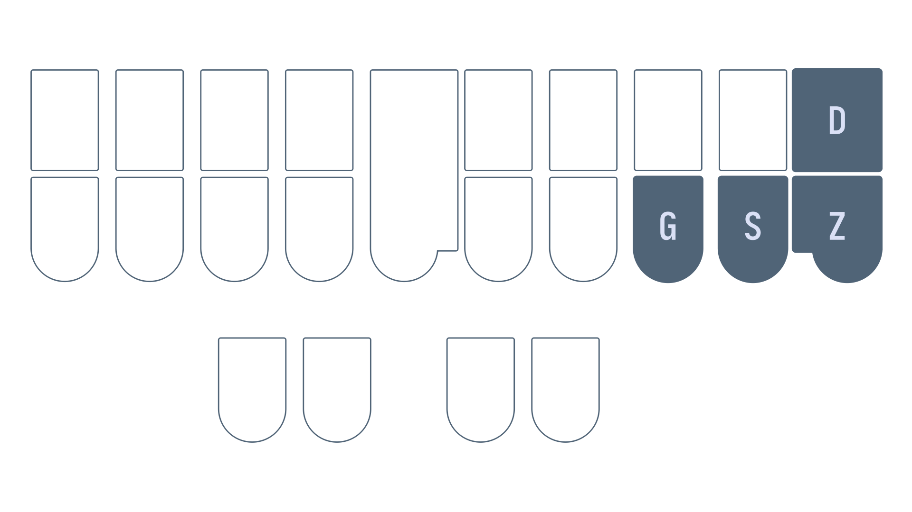

# Chapter 14: Suffix keys and compound words

## Recommended pace

**Recommended time to spend on this chapter: <1 day.**

1. Read [suffix keys](#suffix-keys) and complete the drill (**20 minutes**)
   - Repeat the drill as needed
2. Read [The `A` "prefix" key](#the-a-prefix-key) (**10 minutes**)
2. Read [Compound words](#compound-words) and complete the drill (**20 minutes**)
   - Repeat the drill as needed

Remember to take breaks!

## Useful links

* [Compound words drill](practice/14-compound-words.txt)
* [Words with suffix keys drill](practice/14-suffix-keys.txt)

## Suffix keys

One special type of suffix stroke is the suffix key; these are suffix strokes that contain only one key. There are four on the right hand side which are useful for changing the tense of a verb or for pluralizing nouns.

| Stroke | Suffix | Example outline | Example translation |
| ------ | -------| --------------- | ------------------- |
| `-G` | ^ing | `PAT/-G` | patting |
| `-S` | ^s | `KAT/-S` | cats |
| `-D` | ^ed | `TKPWHRAOU/-D` | glued |
| `-Z` | ^s | `SAOEUD/-Z` | sides |

> **NOTE:** while `-S` and `-Z` have the same definition, you are expected to use `-Z` exclusively.

#### Examples of correct usage
* fasting `TPAFT/-G`
* wedging `WEPBLG/-G`
* typed `TAOEUP/-D`
* served `SEFRB/-D`
* faces `TPAEUS/-Z`
* knives `TPHAOEUF/-Z`

### Folding

> This section on folding is mostly for your interest only. It is not a recommended technique at this point.

*Folding* is an advanced technique where extra keys are included in a stroke regardless of steno order. Folding a suffix key into a stroke is only possible if they key is not already present in another chord. Of the examples above, the following can be written with folded suffix keys:

* fasting `TPAFGT`
* knives `TPHAOEUFZ`
* served `SEFRBD`
* typed `TAOEUPD`

To pluralize words ending in `-T`, normally the `-Z` key is used. For example, "crates" is `KRAEUT/-Z`. However, folding will result in the following stroke:

Some theories will dictate pressing the `-T` with the ring finger and the `-Z` with the pinkie finger. However, this is not a technique used in Lapwing. Instead, the proper way to pluralize the word in one stroke uses the `-S` key: `KRAEUTS`.

#### Plover's steno engine and folded suffix keys

This technique of including a suffix key in the last stroke is "baked" into the English steno engine in Plover. To illustrate this, writing the stroke `HAEPZ`, will output "happies". However, this isn't actually defined in the Lapwing dictionary:

Plover recognizes that the outline `HAEP` is defined as "happy" (this is a Lapwing/Plover brief) and so tries to fold the `-Z` suffix key into the translation. Because of the orthography rules built into the English steno engine, Plover removes the ending "y" and adds "ies" to the translation.

This happens with all of the suffix keys—try out `HAEPD`, `HAEPS`, and `HAEPG`.

#### Should you use folding?

Using the Plover lookup tool, you can find a lot of entries with folded suffix keys. In fact, you won't find many entries where the suffix keys aren't folded into the previous stroke. Despite this, **it is recommended that you do not fold suffix keys**.

Folding can lead to conflicts such as:

| Outline | Canonical Word | Folding Conflict |
| - | - | - |
| `SAOES` | cease | sees |
| `KRAEUZ` | craze | crays |
| `HRAEUZ` | laze | lays |
| `PHRAEUG` | plague | playing |
| `RAEUZ` | raise | rays |
| `SAOEZ` | seize | sees |

While folding can save a stroke for several words, it may not always be faster. Trying to remember any potential conflicts may introduce hesitation; the resulting folded outline may be harder to press (taking longer to stroke); and folding one of these keys may make it easier to accidentally misstroke.

Pressing `-G`, `-S`, `-D`, or `-Z` as a separate stroke is only slightly slower than folding these keys (or just as fast if considering previously mentioned disadvantages). Since `-G`, `-S`, `-D`, or `-Z` are single key strokes, they are quite fast to press. That being said, folding these keys is more of a personal choice and you are more than welcome to try it out.

### Section practice

[Words with suffix keys drill](practice/14-suffix-keys.txt)

## The `A` "prefix" key

While not nearly treated as specially as the suffix keys, the `A` key on its own is a prefix stroke. Contrary to other prefixes that should be used to modify a root word, this stroke can be used entirely on its own without any regard to the semantic meanings of the strokes.

### Examples

* about `A/PWOUT`
* accretion `A/KRAOEGS`
* allow `A/HROU`
* amend `A/PHEPBD`

## Compound words

Compound words (more specifically, closed compound words) consist of two words joined together with nothing in between. To write these, asterisk the first stroke of the second word. If there is already an asterisk in this stroke, leave it as is.

### Examples

* candlelight `KAPBD/-L/HRAO*EUT`
* grasshopper `TKPWRAS/HO*P/*ER`
* eyelash `AOEU/HRA*RB`
* teamwork `TAEPL/WO*RBG`

### Section practice

[Compound words drill](practice/14-compound-words.txt)

## No test this chapter!
