# Chapter 18: Fingerspelling and numbers

## Useful links

* [Fingerspelling graphic (lowercase)](img/18-fingerspelling-lower.png)
* [Fingerspelling graphic (uppercase)](img/18-fingerspelling-upper.png)
* [Numbers graphic](img/18-numbers.png)

## Intro

There won't be any practice material for this chapter as these topics are easy to practise in everyday writing. It may be helpful to keep the tables on this page in an easy to read place (i.e., printed out and taped to the wall).

## Fingerspelling
To write a short acronym or a word that is not yet defined, a letter-by-letter spelling technique called *fingerspelling* can be used. This is done by pressing a letter chord plus the asterisk key with the right hand.

### Lowercase

| | | | | |
| ---- | ---- | ---- | ---- | ---- |
| a   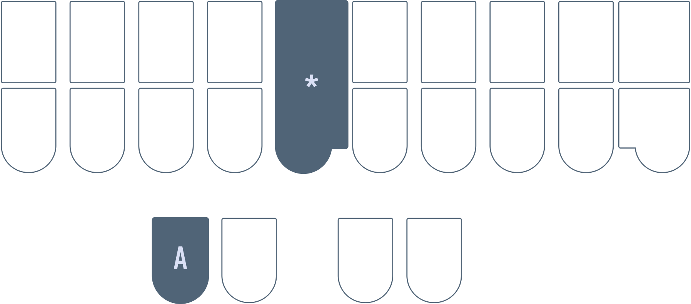 | b    | c    | d    | e    |
| f   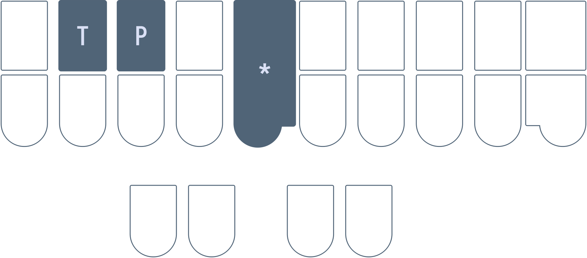 | g    | h    | i    | j   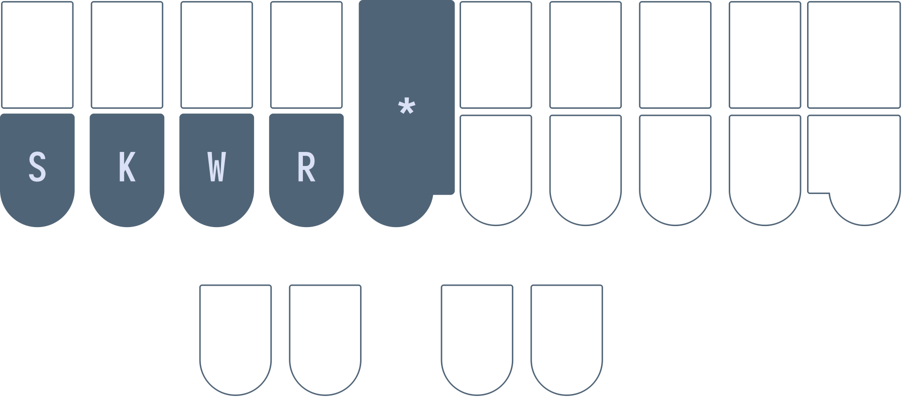 |
| k    | l    | m    | n    | o    |
| p    | q    | r   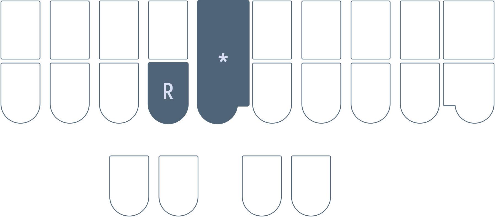 | s   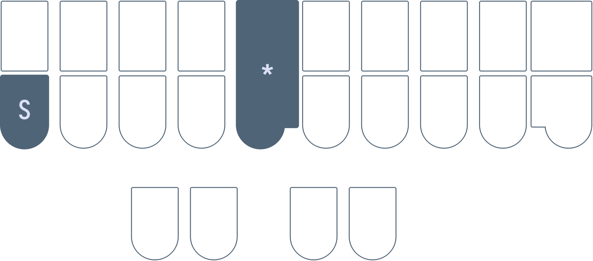 | t    |
| u    | v    | w    | x    | y   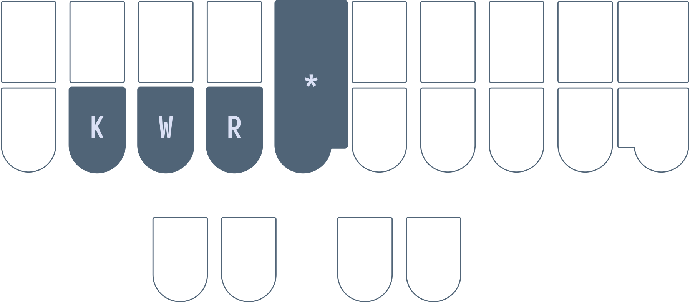 |
|  |  | z    |  |  |

### Uppercase
To write uppercase letters, use `-P` on the right hand.

| | | | | |
| ---- | ---- | ---- | ---- | ---- |
| A    | B    | C    | D    | E    |
| F   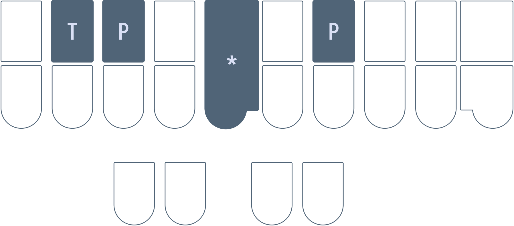 | G    | H   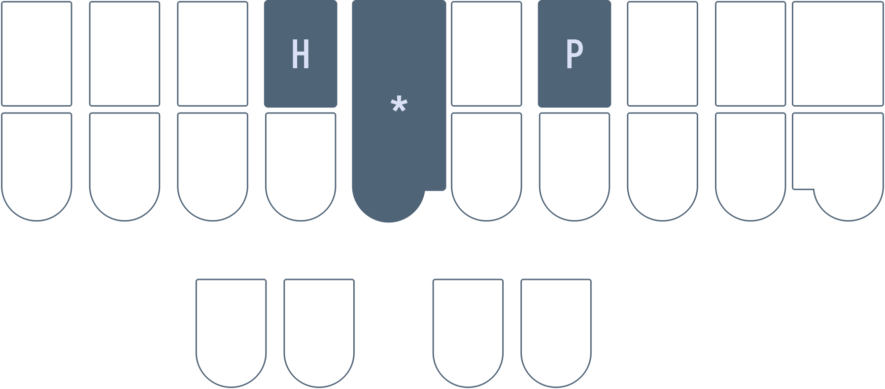 | I   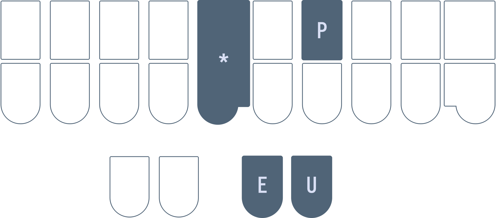 | J    |
| K    | L    | M    | N    | O    |
| P    | Q    | R   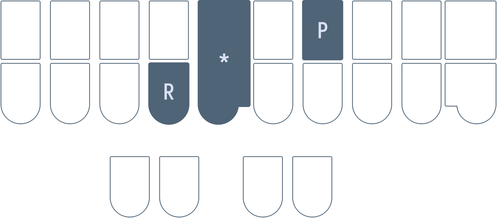 | S    | T    |
| U    | V   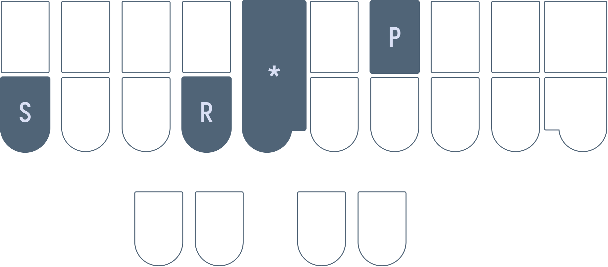 | W    | X    | Y    |
|  |  | Z   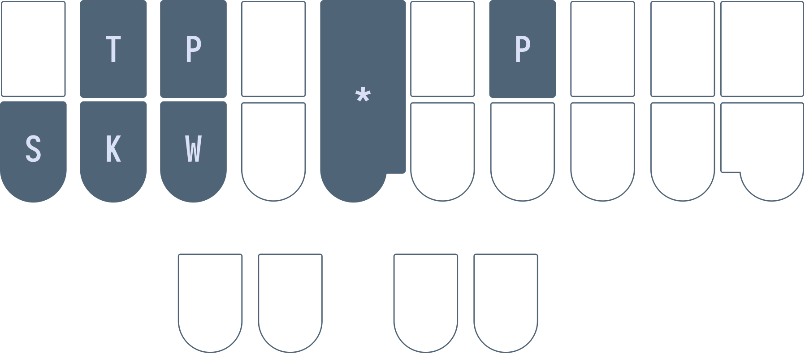 |  |  |

### Attachment behaviour
Fingerspelling uses glue (<code class="code-mono">&</code>) formatting. These translations stick to other translations that also have glue. For example, writing `HE/HROE/A*/PW*/KR*` will result in <code class="code-mono">hello abc</code>. Since the translation for `HE/HROE` contains no glue, the subsequent fingerspelling chord inserts a space after <code class="code-mono">hello</code>. However, as the subsequent fingerspelling chords all contain glue, they stick together.

## Numbers

With Lapwing, numbers are written with a numberpad system much like the ones found on regular keyboards and calculators. The number key is pressed with the left hand, and the right hand is responsible for the number. Since there are only two rows on the steno layout, we use vertical chords to represent the middle row.

| | | |
| ---- | ---- | ---- |
| 1    | 2    | 3   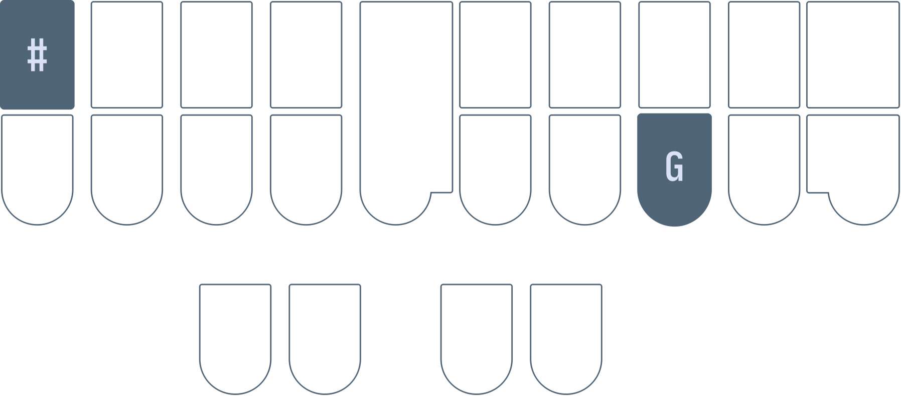 |
| 4    | 5    | 6   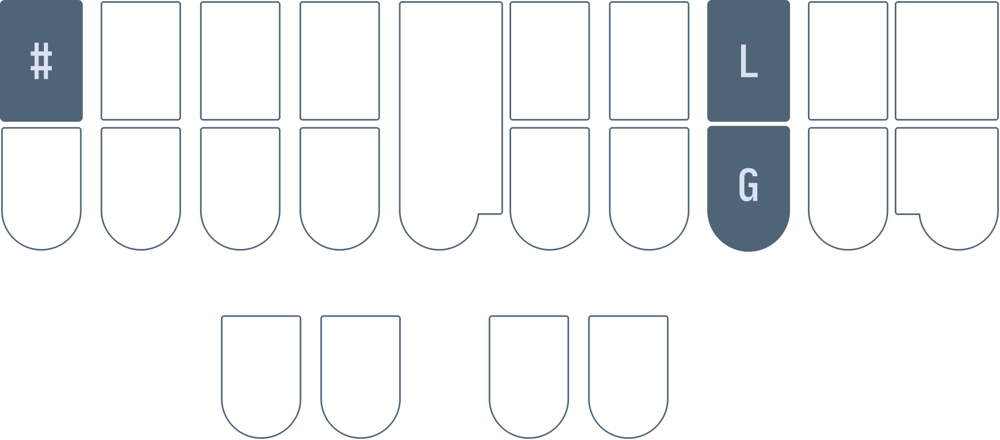 |
| 7    | 8    | 9    |
| 0    | 00    | 000    |

The right hand vowel keys can be combined with a number chord to add some trailing zeros:

* `#ER` 10
* `#EUPB` 5000
* `#UP` 800
* `#EB` 20

### Attachment behaviour
Numbers use the same glue formatting as fingerspelling by default. To prevent numbers from sticking to other glued translations, include `T` with the chord.

#### Examples
* `A*/PW*/KR*/#-R/#-B/#-G` abc123
* `A*/PW*/KR*/#T-R/#T-B/#T-G` abc 1 2 3
