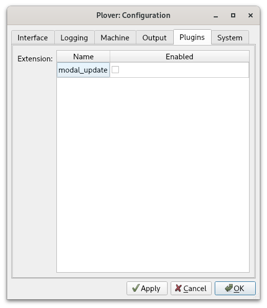
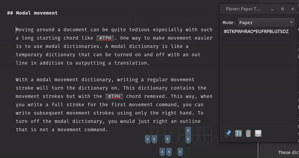
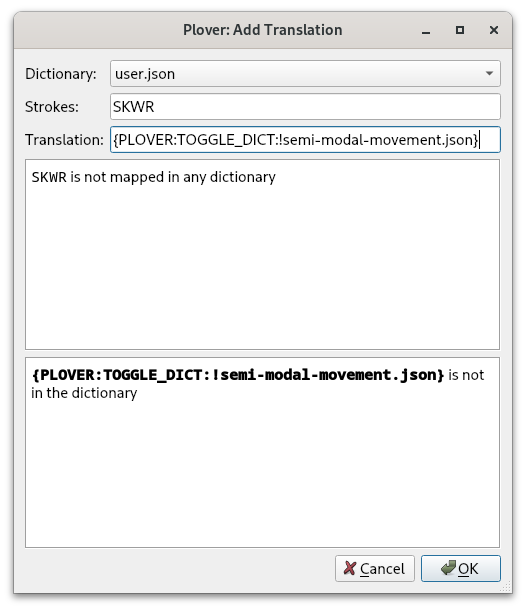

# Chapter 26: Editing text

Lapwing contains some limited movement commands by default. However, if you want to switch to steno full time, you will have to incorporate another method for movement. This chapter goes over the default movement commands in <code class="code-mono">lapwing-base.json</code> as well as some additional methods you can use.

## Movement

### Basic movement

Here's a table of all basic movement commands:

| Outline | Description |
| ---- | ---- |
| `#TPH-R` | Left arrow key <br> <steno-outline stroke="#TPH-R" width="100%" alt="#TPH-R on the steno layout"></steno-outline> |
| `#TPH-P` | Up arrow key <br> <steno-outline stroke="#TPH-P" width="100%" alt="#TPH-P on the steno layout"></steno-outline> |
| `#TPH-B` | Down arrow key <br> <steno-outline stroke="#TPH-B" width="100%" alt="#TPH-B on the steno layout"></steno-outline> |
| `#TPH-G` | Right arrow key <br> <steno-outline stroke="#TPH-G" width="100%" alt="#TPH-G on the steno layout"></steno-outline> |
| `#TPH-FR` | Home <br> <steno-outline stroke="#TPH-FR" width="100%" alt="#TPH-FR on the steno layout"></steno-outline> |
| `#TPH-LG` | End <br> <steno-outline stroke="#TPH-LG" width="100%" alt="#TPH-LG on the steno layout"></steno-outline> |
| `#TPH-FPL` | Top (Ctrl+Home) <br> <steno-outline stroke="#TPH-FPL" width="100%" alt="#TPH-FPL on the steno layout"></steno-outline> |
| `#TPH-RBG` | Bottom (Ctrl+End) <br> <steno-outline stroke="#TPH-RBG" width="100%" alt="#TPH-RBG on the steno layout"></steno-outline> |
| `#TPH-RPG` | Page up <br> <steno-outline stroke="#TPH-RPG" width="100%" alt="#TPH-RPG on the steno layout"></steno-outline> |
| `#TPH-FBL` | Page down <br> <steno-outline stroke="#TPH-FBL" width="100%" alt="#TPH-FBL on the steno layout"></steno-outline> |

The `-RPBG` cluster can be thought of as arrow keys:

<steno-outline stroke="#TPH-R/#TPH-P/#TPH-B/#TPH-G" width="100%" alt="#TPH-R/#TPH-P/#TPH-B/#TPH-G"></steno-outline>

Furthermore, other chords have distinctive shapes reminiscent of their purpose.

* Page up (arrow pointing up)
* Page down (arrow pointing down)
* Home (left column)
* End (right column)
* Top (top row)
* Bottom (bottom row)

#### Moving word by word

On a regular keyboard, the text cursor can be moved word by word by pressing <code class="code-mono">Ctrl</code> and an arrow key. This can also be done by pressing `#TPH-RB` and `#TPH-BG`.

| Outline | Description |
| ---- | ---- |
| `#TPH-RB` | Left by one word <br> <steno-outline stroke="#TPH-RB" width="100%" alt="#TPH-RB on the steno layout"></steno-outline> |
| `#TPH-BG` | Right by one word <br> <steno-outline stroke="#TPH-BG" width="100%" alt="#TPH-BG on the steno layout"></steno-outline> |

#### `-TS` repetition

By including a combination of `-T` and `-S`, a movement key command up to 4 times in one stroke.

| Repetition | Key |
| ---- | ---- |
| 1 | ` ` |
| 2 | `-S` |
| 3 | `-T` |
| 4 | `-TS` |

For example, `#TPH-GT` would move the cursor to the right by three characters and `#TPH-BGT` would move the cursor to the right by three words.

#### Selection

To select text, include the `*` key in a movement command. Repeating the same command works for incrementing the current selection. For example, `#TPH*R/#TPH*R/#TPH*R/#TPH*R` will select the 4 letters to the left.

> **NOTE:** on some systems (particularly Windows machines), selection does not work with numlock enabled. If selection strokes fail, try **disabling numlock**. For keyboards without a physical numlock key, try [this](https://community.acer.com/en/kb/articles/15744-how-to-disable-numlock-if-your-computer-does-not-have-a-numlock-key).

#### Repeat the last command

> **NOTE:** for this to work, you will have to disable the <code class="code-mono">lapwing-prefixed-proper-nouns.json</code> dictionary.

Instead of writing `#TPH*R/#TPH*R/#TPH*R/#TPH*R`, the number key can be pressed to repeat the last outline: `#TPH*R/#/#/#`.

> **NOTE:** this requires the <code class="code-mono">plover-last-translation</code> plugin if you are not using <code class="code-mono">plover-lapwing-aio</code>.

#### MacOS commands

Replace all occurrences of "Control" with "Alt" in the movement commands if you are on macOS.

### Modal movement

> **NOTE:** this movement method is not compatible with Javelin. See [Appendix C](Appendix-C.md#chapter-26) for more details.

#### Setup

Ensure that <code class="code-mono">plover-lapwing-aio</code> is installed and <code class="code-mono">Lapwing</code> is selected as the system. Alternatively, if you are setting up [Lapwing manually](Appendix-B.md) (not recommended), ensure that <code class="code-mono">lapwing-movement.modal</code> is in your dictionary stack.

After verifying that <code class="code-mono">lapwing-movement.modal</code> is in the dictionary stack, go to <code class="code-mono">Configure → Plugins</code> and check the <code class="code-mono">modal_update</code> box as shown below.



#### Modal dictionaries

Moving around a document can be quite tedious especially with such a long starting chord like `#TPH`. One way to make movement easier is to use a modal dictionary. This is a temporary dictionary that can be turned on and off with a regular outline that also outputs a translation.

A modal movement dictionary contains the regular movement strokes, but with the `#TPH` chord removed. Writing a normal movement stroke will turn this dictionary on, so that every subsequent movement stroke can be written using only the right hand. Writing a non-movement stroke will turn this dictionary back off.



> **NOTE:** this plugin is incompatible with some plugins such as plover-clippy. The creator has expressed that it is a bit of a hacky plugin.

#### Semi-modal movement

If you do not want to use modal dictionaries, you can also use the [semi-modal movement dictionary](https://github.com/aerickt/steno-dictionaries/blob/main/lapwing-semi-modal-movement.json). This also contains movement strokes without the left hand starting chord.

You can download the dictionary from the link above and make sure you add it to the top of your stack. Uncheck the box so that it is disabled by default. The idea is that you can enable this dictionary only when you need to move the text cursor.

To achieve this, you will need to add a toggling entry to one of your dictionaries:

```
{PLOVER:TOGGLE_DICT:!semi-modal-movement.json}
```



Now, whenever you want to move the text cursor without having to use a left hand starting chord, just write `SKWR` (or whatever stroke you chose) and then `SKWR` again when you're done.

### First-up chord send and chord repeat

Quick video introducing these two firmware mods: [https://youtu.be/UMGT-qyJeJk](https://youtu.be/UMGT-qyJeJk).

#### First-up chord send

Steno keyboards send stroke information to Plover once all keys have been released. You can test this out for yourself. Hold down `S` and press other keys on the steno layout. Plover will not receive any strokes as long as `S` (or any other key) is being held down. Once every key has been released, Plover will register the stroke.

Alternatively, you could have your keyboard send stroke information once the first key has been released. This is what "first-up chord send" refers to: stroke information is sent to Plover as soon as the first key has been released. This is very useful for repeating movement keys without using a separate dictionary or pressing the entire stroke each time.

By holding down the left hand starter chord, you can tap a right hand key repeatedly to move the cursor multiple times. In fact, as long as the left hand starter chord is being held, you can tap any of the right hand movement chords.


However, there are two caveats with this technique: firstly, it involves modifying your keyboard's firmware. Secondly, it may cause your accuracy to drop if you're writing fast. Personally, wrong strokes are very often detected by Plover when I try to use first-up chord send. It may be that my writing is sloppy and I am not too careful and deliberate about my stroke actions, but I have not been able to get used to this firmware mod.

#### Chord repeat

Chord repeat works a lot like holding down a key on a regular keyboard. However, as we often hold chords when we hesitate, it is more useful to double tap a chord and hold to signify that we want to repeat the chord.


This technique also requires modifying your keyboard's firmware. Unlike first-up chord send, I do recommend this and find it very useful.

#### Ecosteno, Multisteno, Splitography, Uni v3

For these keyboards, prebuilt firmware binaries for these mods are available at Josh Gram's [steno-firmware](https://github.com/JoshuaGrams/steno-firmware) repository.

Flashing these firmware files are beyond the scope of this page, and instructions differ from keyboard to keyboard and machine to machine. On Linux, flashing the Multisteno is relatively straightforward as long as <code class="code-mono">dfu-util</code> is installed. I use the following command (where <code class="code-mono">noll_multisteno.bin</code> is the binary):

```
sudo dfu-util -d 1eaf:0003 -a 2 -D "noll_multisteno.bin"
```

#### Javelin compatible devices

[Javelin](https://lim.au/#/software/javelin-steno) is a steno engine that is contained within a keyboard's firmware. This allows the keyboard to act a steno writer without having to install Plover on the host machine. It is very useful for using steno on multiple devices without having to worry about installing Plover or syncing dictionaries; the entirety of the translation from steno strokes to text happens on the keyboard itself.

Javelin is compatible with several steno keyboards such as the Uni v4 and the Polyglot. It is much easier to create custom firmware builds and flash binaries to these keyboards via the Javelin Steno Firmware Builder. By checking the "Show expert options" at the very top of the page, you have the option of enabling first up chord send and/or repeat.

If you don't intend to use Javelin's embedded steno capability, you can also still use Plover with keyboards that have Javelin firmware. For each keyboard, you will have to press a key combination to switch it into Gemini PR for usage with Plover.

## Copying, pasting, and deleting text

Copying and pasting of text is done by simply emulating the <code class="code-mono">Ctrl+C</code> and <code class="code-mono">Ctrl+V</code> shortcuts. Using Abby's left hand modifiers, this would be `KHR/KR` and `KHR/SR` respectively. The same goes for cutting text.

The following table lists a few helpful strokes for deleting text. It is important to note that using these strokes will mess up any undo history with the `*`.

| Outline | Translation | Description |
| ---- | ---- | ---- |
| `PW-FP` | <code class="code-mono">{#BackSpace}{^}</code> | Backspace |
| `PW*FP` | <code class="code-mono">{#Control(BackSpace)}{^}</code> | Backspace the last word (change translation if you're on Mac) |
| `TKHR` | <code class="code-mono">{#Delete}{^}</code> | Delete the next character |
| `TKHR*` | <code class="code-mono">{#Control(Delete)}{^}</code> | Delete the next word |
